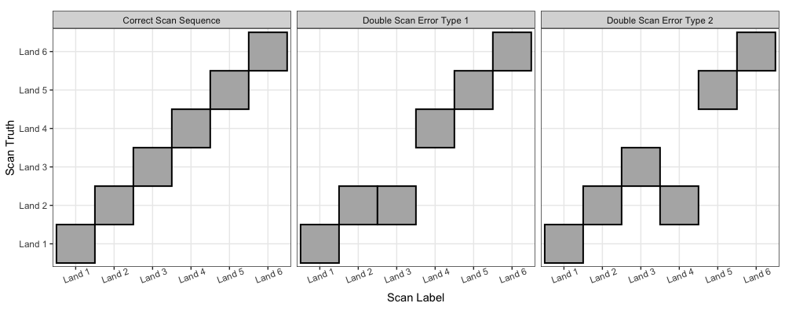

# Signature Modeling - Lighting Settings  

.center[
```{r, echo = F, warning = F, message = F, out.width = '750px'}
knitr::include_graphics("images/variability/lighting-x10-used.png")

```
]

---

# Signature Modeling - Lighting Settings  

```{r, echo = F, warning = F, message = F, out.width = '900px'}

```


---

# Signature Modeling - Data Trimming  

.center[
```{r, echo = F, warning = F, message = F, out.width = '800px'}

```
]
---

# Signature Modeling - Data Imbalance  

.center[
```{r, echo = F, warning = F, message = F, out.width = '800px'}

```
]


---

# Signature Modeling - Window Sizes  

```{r, echo = F, warning = F, message = F, out.width = '900px'}

```

---

# Signature Modeling - Singularities  

```{r, echo = F, warning = F, message = F, out.width = '900px'}

```

---

# Signature Modeling - Model Output  


---

# Pairwise Modeling - Pairing IDs    

```{r, echo = F, warning = F, message = F, out.width = '900px'}

```

