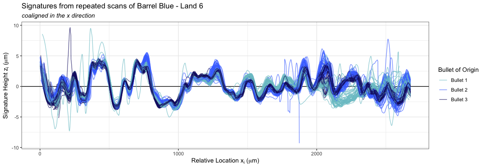
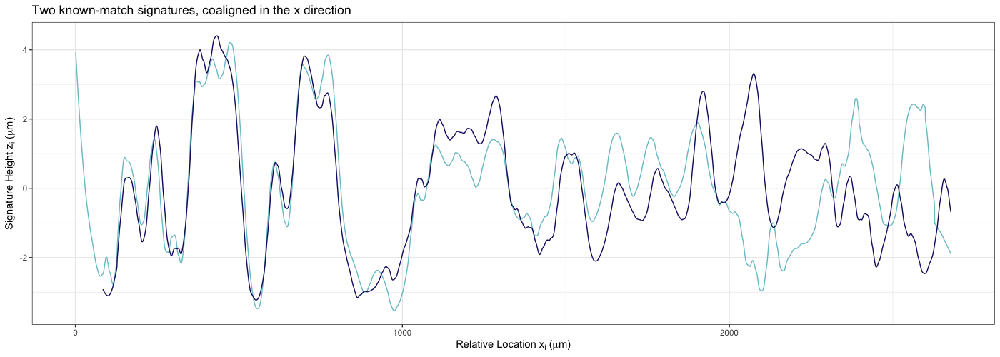
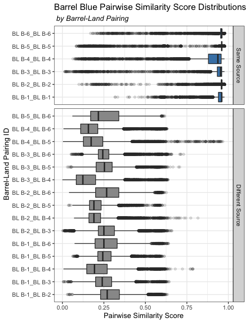
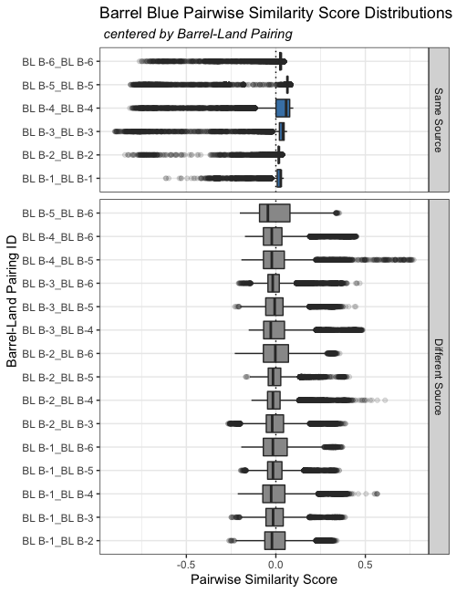
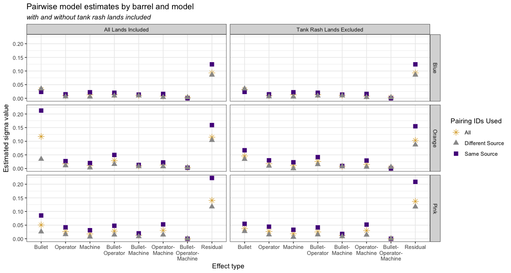
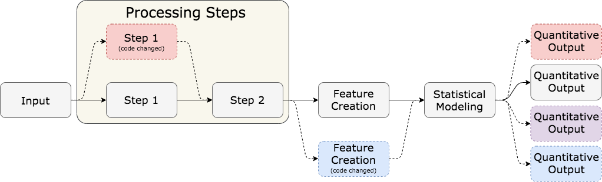
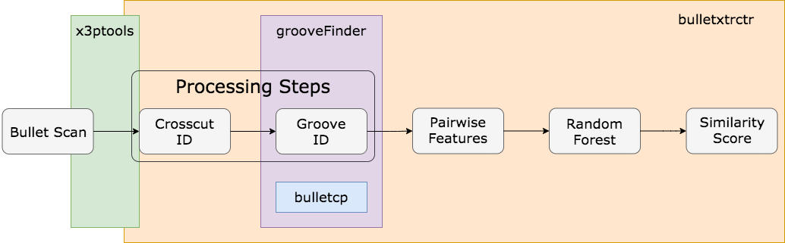

# Two stages of modeling  

.center[**2D LEA signatures**  


```{r, echo = F, warning = F, message = F, out.width = '600px'}

```
]

--

.center[
**Pairwise similarity scores**  

```{r, echo = F, warning = F, message = F, out.width = '600px'}

```
]


---

class: inverse, middle, center

# Pairwise modeling approach       

---

# Pairwise-level model      

Three-factor Gauge R&R random effects model for our study design.  

Let $z_{jkmn}$ be the measured response for bullet $j$, operator $k$, machine $m$, and repetition $n$. 

$$\begin{array}{rl}
z_{jkmn} & = \mu + \beta_j + \omega_k + \gamma_m + \beta\omega_{jk} + \beta\gamma_{jm} + \omega\gamma_{km} +
\beta\gamma\omega_{jkm} + \epsilon_{jkmn},
\end{array}$$

with a fixed, unknown process mean $\mu$ and random effects

.medium[
$$\begin{array}{rl}
\beta_{j} & \quad \mbox{for Bullet}\ j,\ \mbox{following a}\ N(0, \sigma^2_{\beta})\\
\omega_{k} &\quad \mbox{for Operator}\ k,\ \mbox{following a}\ N(0, \sigma^2_{\omega}) \\
\gamma_{m} & \quad \mbox{for Machine}\ m\,\ \mbox{following a}\ N(0, \sigma^2_{\gamma}) \\
\beta\omega_{jk} & \quad \mbox{for Bullet}\ j\times\mbox{Operator}\ k,\ \mbox{following a}\ N(0, \sigma^2_{\beta\omega})  \\
\beta\gamma_{jm} & \quad \mbox{for Bullet}\ j\times\mbox{Machine}\ m,\ \mbox{following a}\ N(0, \sigma^2_{\beta\gamma})  \\
\omega\gamma_{km} & \quad \mbox{for Operator}\ k\times\mbox{Machine}\ m,\ \mbox{following a}\ N(0, \sigma^2_{\omega\gamma})  \\
\beta\omega\gamma_{jkm} & \quad \mbox{for Bullet}\ j\times\mbox{Operator}\ k\times\mbox{Machine}\ m,\ \mbox{following a}\ N(0, \sigma^2_{\beta\omega\gamma})  \\
\epsilon_{jkmn} & \quad \mbox{is error across repetitions},\ \mbox{following a}\ N(0, \sigma^2) \\
\end{array}$$
]

--

Here, we need to make an adaptation to the grouping and index structure...  


---

# Pairwise-level model      

We can't index similarity scores simply by $z_{jkmn}$: bullet $j$, operator $k$, machine $m$, and repetition $n$, because similarity scores are *pairwise*, and involve multiple levels.  
  - bullet 1 - operator 1 - machine 1 - repetition 1  
  - bullet 3 - operator 2 - machine 1 - repetition 3  

For similarity scores, we therefore index by *level pairing*.  

For example, instead of bullet $j$, we have bullet pairing $(j)'$:  
  - Bullets $j = 1, 2, 3$
  - Bullet pairing $(j)' = (1-1), (1-2), (1-3), (2-2), (2-3), (3-3)$  

We then have similarity score $z_{(j)'(k)'(m)'(n)'}$ which compares two signatures with bullet pairing $(j)'$, operator pairing $(k)'$, machine pairing $(m)'$, and repetition pair $(n)'$.  


  
---

# Pairwise-level model      


.left-code[
We also expect scores and score distributions to differ by which LEAs are being compared:  
  - Same-source comparisons should have high scores near 1
  - Different-source comparisons should have lower scores 
  - Different-source comparisons are not all different *in the same way*  
  
]

--

.right-plot[
.center[
```{r, echo = F, warning = F, message = F, out.width = '400px'}

```
]
]


---

# Pairwise-level model      


.left-code[
We also expect scores and score distributions to differ by which LEAs are being compared:  
  - Same-source comparisons should have high scores near 1
  - Different-source comparisons should have lower scores 
  - Different-source comparisons are not all different *in the same way*  
  
To account for this, we use the barrel-land pairing as a mean structure and fit three separate models:   

1. Same-source pairs only   
2. Different-source pairs only  
3. All pairs, pooled  
  
]


.right-plot[
.center[
```{r, echo = F, warning = F, message = F, out.width = '400px'}

```
]
]

---

# Pairwise-level model  

$$\begin{array}{rl}
z_{(L)'(j)'(k)'(m)'(n)'} & = \mu + \alpha_{(L)'} + \alpha\beta_{(L)'(j)'} + \alpha\omega_{(L)'(k)'} + \alpha\gamma_{(L)'(m)'} + \alpha\beta\omega_{(L)'(j)'(k)'} \\
&   \quad \quad +\ \alpha\beta\gamma_{(L)'(j)'(m)'} + \alpha\omega\gamma_{(L)'(k)'(m)'}+ \alpha\beta\omega\gamma_{(L)'(j)'(k)'(m)'} + \epsilon,
\end{array}$$

with fixed, unknown similarity mean $\mu$, fixed mean for barrel-land pairing $\alpha_{(L)'}$ and random effects

.medium[
$$\begin{array}{rl}
\alpha\beta_{(L)'(j)'} & \quad \mbox{for Bullet pairing}\ (j)'\ \mbox{by Barrel-Land pairing}\ (L)',\\
& \quad \quad \quad \mbox{following a}\ N(0, \sigma^2_{(\beta)'})\\
\alpha\omega_{(L)'(k)'} &\quad \mbox{for Operator pairing}\ (k)'\ \mbox{by Barrel-Land pairing}\ (L)',\\
& \quad \quad \quad \mbox{following a}\ N(0, \sigma^2_{(\omega)'}) \\
\alpha\gamma_{(L)'(m)'} & \quad \mbox{for Machine pairing}\ (m)'\ \mbox{by Barrel-Land pairing}\ (L)',\\
& \quad \quad \quad\mbox{following a}\ N(0, \sigma^2_{(\gamma)'}) \\
\alpha\beta\omega_{(L)'(j)'(k)'} & \quad \mbox{for Bullet pairing}\ (j)'\times\mbox{Operator pairing}\ (k)'\\
& \quad \quad \quad \mbox{by Barrel-Land pairing}\ (L)', \mbox{following a}\ N(0, \sigma^2_{(\beta\omega)'})  \\
\alpha\beta\gamma_{(L)'(j)'(m)'} & \quad \mbox{for Bullet pairing}\ (j)'\times\mbox{Machine pairing}\ (m)'\\
& \quad \quad \mbox{by Barrel-Land pairing}\ (L)'\, \mbox{following a}\ N(0, \sigma^2_{(\beta\gamma)'}) \\
\alpha\omega\gamma_{(L)'(k)'(m)'} & \quad \mbox{for Operator pairing}\ (k)'\times\mbox{Machine pairing}\ (m)'\\
& \quad \quad \quad \mbox{by Barrel-Land pairing}\ (L)', \mbox{following a}\ N(0, \sigma^2_{(\omega\gamma)'})  \\
\alpha\beta\omega\gamma_{(L)'(j)'(k)'(m)'} & \quad \mbox{for Bullet pairing}\ (j)'\times\mbox{Operator pairing}\ (k)'\times\\
& \quad \quad \quad \mbox{-Machine pairing}\ (m)'\ \mbox{by Barrel-Land pairing}\ (L)',\ \\
& \quad \quad \quad \mbox{following a}\ N(0, \sigma^2_{(\beta\omega\gamma)'})  \\
\epsilon_{(L)'(j)'(k)'(m)'(n)'} & \quad \mbox{is error across repetitions},\ \mbox{following a}\ N(0, \sigma^2).
\end{array}$$
]


---

class: inverse, middle, center

# Results     


---

# Pairwise-level results: All Barrels  

We present results for all three barrels and all three pairwise models. 

.center[
```{r, echo = F, warning = F, message = F, out.width = '900px'}


```
]

---

# Pairwise-level results: All Barrels  

Scores are on a $[0,1]$ scale.  

.pull-left[
Barrel Orange 
.medium[
$$\begin{array}{ccc}
\mbox{Model}      & \sigma_{repeatability} & \sigma_{reproducibility} \\ \hline
\textbf{Same-Source} & \textit{0.155} & \textit{0.092}\\ 
\textbf{Different-Source}     & \textit{0.087} & \textit{0.040} \\ \hline 
\textbf{All Pairings} & \textit{0.103} & \textit{0.059}\\ \hline
\end{array}$$
]

Barrel Pink
.medium[
$$\begin{array}{ccc}
\mbox{Model}      & \sigma_{repeatability} & \sigma_{reproducibility} \\ \hline
\textbf{Same-Source}     & \textit{0.209} & \textit{0.104} \\ 
\textbf{Different-Source}     & \textit{0.117} & \textit{0.039} \\ \hline
\textbf{All Pairings} & \textit{0.137} & \textit{0.064} \\ \hline
\end{array}$$
]
]

.pull-right[
Barrel Blue
.medium[
$$\begin{array}{ccc}
\mbox{Model}      & \sigma_{repeatability} & \sigma_{reproducibility} \\ \hline
\textbf{Same-Source}     & 0.124 & 0.046 \\ 
\textbf{Different-Source}     & 0.085 & 0.038 \\\hline \hline
\textbf{All Pairings}  & 0.093 & 0.040 \\ \hline
\end{array}$$
]
]


---

class: inverse, middle, center

# Computational Reproducibility   


---

# Variation in Data Analysis   

  
<br />  

(1) varying input (*variation in data measurement*)  
(2) varying methods (*decisions by the statistician*)  
(3) **varying code** (*differences in underlying software packages*)  

<br />

```{r, echo = F, warning = F, message = F, out.width = '800px'}

```

---

# What is Computational Reproducibility? 


1. Literate programming and reporting  
    - Self-contained documents - include the code used to generate results and figures.  
    - [`knitr`](https://yihui.org/knitr/) by Yihui Xie  
2. Numerical reproducibility of results 
    - Code of any kind used to complete an analysis or generate results  
    - Reproduction of analysis or results across users/machines, or over time  
    
(1) helps with *transparency* of methodology in research, (2) helps with *consistency* of methodology.  


---

# Computational Reproducibility in R  


**`base` R**   
   - provides base language model  
   - data structures, framework for object manipulation, function syntax  

**user-developed packages**
   - many data analysis and data science capabilities  
   - `randomForest`, `lme4`, `tidyverse`, `knitr`....  

**R packages can change over time**  

  - CRAN (Comprehensive R Archive Network) 
  - GitHub versions of many popular packages also exist    

**R package versioning is user/machine-specific**  

  - User must install and upgrade packages  
  - Different sets of packages, different versions of those packages  


---

class: inverse, middle, center

# Case Study  

```{r, fig.width = 1, fig.height = .5, out.width=150}
 
knitr::include_graphics("images/grooveFinder-hex.png") 
knitr::include_graphics("images/x3ptools-hex.png")
```

---

# `bulletxtrctr` `r emo::ji("package")` background  

`bulletxtrctr` is one of several packages developed by a team of researchers at the Center for Statistics and Applications in Forensic Evidence (CSAFE) at Iowa State.  

Automated forensic evidence comparison, using high-resolution images of bullet evidence.  

--

```{r, out.width = '\\textwidth'}

```

---

# `bulletxtrctr` package background  

The suite of packages is both **used** and **developed** by a small-ish team of researchers. This means:  

1. Under active development, subject to change  
2. Team members may have different versions of packages   
3. Analyses vulnerable to changes  

We investigate:  

- extent of package dependency for the project  
- package versioning differences on a team  


---

# `bulletxtrctr` package background  

```{r, echo = F, eval = T}
bulletxtrctr_inventory <- readRDS("data/kiegan_bulletxtrctr_inventory.rda")
```

```{r, echo = T, eval = T, fig.width = 9, fig.height = 5, warning = F, message = F}
plot_inventory(bulletxtrctr_inventory)
```


---

# `bulletxtrctr` study set-up    

Researchers on the bullet team used our tools to take and send package inventories.   

  - 9 different inventories 
  - 6 users (one user on 3 machines, another user on 2 machines)  

What versions of each package do team members have?  


---

# Bullet Package Versions  


```{r, warning = F, echo = F, message = F, fig.align = 'center', fig.width = 9, fig.height = 4}
bullet_package_versions <- read_csv("data/bullet_package_versions.csv")
bullet_package_versions %>%
  ggplot() + 
  geom_tile(aes(x = package_name, y = user_computer, 
                fill = version_info), height = 0.9, width = 0.9, 
            alpha = 0.9) + 
  theme_bw() + 
  scale_fill_manual(name = "Version Info", breaks = c("newest", "newer", "older", "oldest", "local"),
                     values = c("grey90", "grey60", "grey30", "black", "red4")) + 
  coord_flip() + 
  #theme(aspect.ratio = 4/9) + 
  labs(y = "", x = "Package Name", title = "Package version by user and machine") 

```


---

# Other Package Versions  


```{r, warning = F, echo = F, message = F, fig.align = 'center', fig.width = 9, fig.height = 8, out.width = "77%"}
nonbullet_package_meta <- read_csv("data/nonbullet_package_versions.csv")

nonbullet_package_meta %>%
  mutate(checksum_num = factor(checksum_num, levels = c("Newest", "Newer", "Middle", "Older", "Oldest"))) %>%
  ggplot() + 
  geom_tile(aes(x = user_computer, y = package_name, 
                fill = checksum_num, color = package_source), 
            width = 0.85, height = 0.85, alpha = 0.9, size = 1) +
  theme_bw() + 
  #facet_grid(rows = "package_name", scales = "free", space = "free") + 
  scale_fill_manual(name = "Package\nversion", 
                    values = c("white", "grey80", "grey60", "grey20", "black")) + 
  scale_color_manual(name = "Package\nsource",
                     values = c("black", "goldenrod2")) + 
  theme(plot.subtitle = element_text(face = "italic")) + 
  labs(x = "", y = "Object name", title = "Package version by user and machine", 
       subtitle = "for 15 of 73 packages which differ") + 
  geom_text(aes(x = user_computer, y = package_name, label = package_version),
            size = 3) + 
  geom_text(aes(x = user_computer, y = package_name, label = package_version), 
            color = "white",size = 3, 
            data = nonbullet_package_meta %>% filter((checksum_num == "Older" | checksum_num == "Oldest")))
  
```

---

# Bullet Packages: Practical Differences  

```{r, message = F, warning = F, fig.height = 8, fig.width = 9, out.width = "80%"}

bullet_object_versions <- read_csv("data/bullet_package_object_versions.csv")
bullet_object_versions %>%
  ggplot() + 
  geom_tile(aes(x = user_computer, y = object_name, 
                fill = checksum_num, color = factor(checksum_num_param)), 
            width = 0.82, height = 0.82, size = 1, alpha = 0.9) +
  theme_bw() + 
  facet_grid(rows = "package_name", scales = "free", space = "free") + 
  scale_fill_manual(name = "Function\nversion", 
                    values = c("white", "grey80", "grey60", "grey30", "black")) + 
  scale_color_manual(name = "Parameters\nversion", breaks = c("1", "2", "3"), 
                     values = c("royalblue4", "darkred", "goldenrod2")) + 
  theme(plot.subtitle = element_text(face = "italic")) + 
  labs(x = "", y = "Object name", title = "Object version by user and machine", 
       subtitle = "For package objects with differences") + 
  geom_text(aes(x = user_computer, y = object_name, label = checksum_num),
            size = 3, data = bullet_object_versions %>% filter(checksum_num != "A")) + 
  geom_text(aes(x = user_computer, y = object_name, label = checksum_num),
            size = 3, color = "white", 
            data = bullet_object_versions %>% filter((checksum_num == "D" | checksum_num == "E")))
```


---

# Computational Reproducibility Conclusions  

- package versioning can impact computational reproducibility  

- collection and visualization of practical differences  

- team-based collaboration vulnerable  


