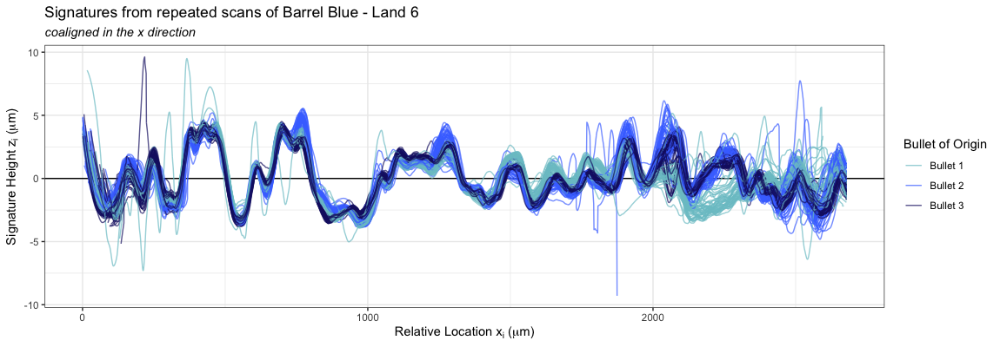
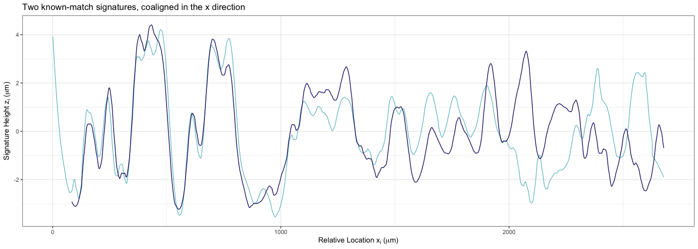

# Outline  

<br />

- Reproducibility in Data Analysis  

<br />
- Forensic Firearms Analysis  

<br /> 

- Study Design and Data Collection   

<br /> 

- Modeling Approach   

<br />

- Results and Conclusions  


---

class: inverse, middle, center

# Defining Reproducibility in Data Analysis  


---

# Data Analysis as a Process   

Any data analysis can be conceptualized as a **pipeline**<sup>1</sup>.  
  - linear, sequential actions   
  - raw data to result  


.footnote[[1] `r Cite(myBib, "buja")`] 

--

  
    
.center[.img[
```{r, echo = F, warning = F, message = F, out.width = '800px'}
knitr::include_graphics("images/pipeline/pipeline_basic.png")
```
]]


---

# Data Analysis as a Process   

Any data analysis can be conceptualized as a **pipeline**<sup>1</sup>.  
  - linear, sequential actions   
  - raw data to result  


.footnote[[1] `r Cite(myBib, "buja")`] 

.center[.img[
```{r, echo = F, warning = F, message = F, out.width = '800px'}
knitr::include_graphics("images/pipeline/pipeline_v1_update.png")
```
]]  


---

# Variation in Data Analysis   


<br />  

(1) varying input (*variation in data measurement*)  
(2)  
(3)  

<br />


```{r, echo = F, warning = F, message = F, out.width = '800px'}

```


---

# Variation in Data Analysis   

<br />  

(1) varying input (*variation in data measurement*)  
(2) varying methods (*decisions by the statistician*)  
(3)

<br />


```{r, echo = F, warning = F, message = F, out.width = '800px'}
knitr::include_graphics("images/pipeline/pipeline_processing_update.png")
```


---

# Variation in Data Analysis   

  
<br />  

(1) varying input (*variation in data measurement*)  
(2) varying methods (*decisions by the statistician*)  
(3) varying code (*differences in underlying software packages*)  

<br />

```{r, echo = F, warning = F, message = F, out.width = '800px'}
knitr::include_graphics("images/pipeline/pipeline_coding_update.png")
```


---

# Process Reproducibility  


**Is this process reproducible?**  
  - variability of quantitative output   
  - applies to multiple *types* of variation  

<br /> 
--
**Application to large-scale data analysis process**  
  - bullet matching in forensic firearms analysis  


---

class: inverse, middle, center

# Forensic Firearms Analysis  

---

# Bullets as Forensic Evidence   

<br /> 
$$\begin{array}{rcl}
\textbf{microimperfections in barrel} & \to & \mbox{engraved patterns on bullet}\\
\mbox{lands} & \to & \mbox{land engraved areas (LEAs)}\\
\mbox{6 lands} & \to & \mbox{6 LEAs}\\
\end{array}$$

<br />  

.center[
```{r rifling-and-bullets, echo = F, warning = F, message = F,out.width=c('400px', '300px')}
knitr::include_graphics("images/scanning-stage0.png")

```
]

<br /> 
.center[striation patterns compared on two LEAs]  


---

# Bullets as Forensic Evidence   

<br />
.center[
```{r, echo = F, warning = F, message = F, out.width = '900px'}
knitr::include_graphics("images/bullet-lea-area-markings.png")
```
]


---

# Criticisms of Forensic Firearms Analysis   

**Question of interest**: same source or different source  
**Assumptions**: 
  - consistency: a gun will leave same striation pattern on each bullet over time  
  - uniqueness: no two guns will produce the same striation patterns  

**Recent criticisms**<sup>2</sup> <sup>3</sup>:  
  - lack of peer-reviewed scientific research  
  - lack of large-scale studies  
  - quantifiable error rates  
  
**Proposed solution**: image-analysis algorithms for bullet comparison

.footnote[
[2] `r Cite(myBib, "NRC2009")`  
[3] (President's Council of Advisors on Science and Technology, 2016)  
]  


---

# Automated Bullet Land Comparison   


Hare et al. of the Center for Statistics and Applications in Forensic Evidence (CSAFE) developed an automated bullet-matching process which completes pairwise comparisons of bullet LEAs<sup>4</sup>.  

.footnote[
[4] `r Cite(myBib, "Hare1")`
]

.left-code[
<br />
The Hare et al. method processes 3D scans by: 
  1. taking a horizontal crosscut  
  2. removing extraneous GEA data  
  3. removing bullet curvature  
  4. smoothing  

Result: **2D LEA signature** 
  - represents striation pattern  
]

.right-plot[
```{r, echo= F, warning = F, message = F, out.width = '550px'}


```
]

---

# Bullet Analysis as a Process  

Hare et al. process as pipeline:  

```{r, echo = F, warning = F, message = F, out.width = '800px'}
knitr::include_graphics("images/pipeline/pipeline_bullet_update.png")
```

<br />

**Is the process reproducible?**  

--

<br />

```{r, echo = F, warning = F, message = F, out.width = '800px'}

```


---

class: inverse, middle, center

# Measuring Repeatability and Reproducibility   


---

# Gauge Repeatability and Reproducibility  

**Gauge Repeatability and Reproducibility** studies are used in engineering to test a measurement system.  

Gauge R&R studies focus on *repeated measurements*  
  1. **repeatability** of measurements under the same environmental conditions  
    - same object, same operator  
  2. **reproducibility** of measurements under different environmental conditions
    - same object, different operators  


---

# Gauge Repeatability and Reproducibility  

Let $y_{ijk}$ be the measured value of part $i$, taken by operator $j$, at repetition $k$.  


$$y_{ijk} = \mu + \alpha_{i} + \beta_{j} + \alpha\beta_{ij} + \epsilon_{ijk}$$

with fixed, unknown process mean $\mu$ and random effects 


$$\begin{array}{rl}
\alpha_i & \quad \mbox{for Part}\ i,\ \mbox{following a}\ N(0, \sigma^2_{\alpha}), \\
\beta_j &\quad \mbox{for Operator}\ j,\ \mbox{following a}\ N(0, \sigma^2_{\beta})\\
\alpha\beta_{ij} & \quad \mbox{for Part}\ i\times\mbox{Operator}\ j,\ \mbox{following a}\ N(0, \sigma^2_{\alpha\beta})  \\
\epsilon_{ijk} & \quad \mbox{is measurement error across repetitions},\ \mbox{following a}\ N(0, \sigma^2).
\end{array}$$

We assume:  

- all $\alpha_i,\ \beta_j,\ \alpha\beta_{ij},\ \epsilon_{ijk}$ are independent random variables  
- $\sigma^2_{\alpha},\ \sigma^2_{\beta},\ \sigma^2_{\alpha\beta},\ \sigma^2$ are variance components   

---

# Gauge Repeatability and Reproducibility  

Variance components from the model can be summarized by two quantities:  

.center[
$\sigma_{\mbox{repeatability}} = \sqrt{\sigma^2},$  

measurement error for *fixed environmental conditions*.  

<br /> 

$\sigma_{\mbox{reproducibility}} = \sqrt{\sigma^2_{\beta} + \sigma^2_{\alpha\beta}},$  


variability in environmental conditions *for a fixed object*.  
]

---

class: inverse, middle, center

# Study Design and Data Collection     


---

# Three-Factor Study Design       

.left-text[
Consider barrel-lands to be the objects we are measuring.  

**Parts**: bullets  

- fired through the same gun barrel  
- striation mark is pattern we want reproduced   
- LEAs from same barrel *similar*, but not *identical*  


**Operators**: microscope operators  

- responsible for physical staging  


**Devices**: microscopes  

**Repetition**  

- scans of same barrel-land in same conditions (same bullet, operator, and microscope)  
]


.right-code[
<br />
```{r, echo= F, warning = F, message = F, out.width = '500px'}


```
]

---

# Scale of Study  

<br />  
- **machines**: 2 Sensofar Confocal Light Microscopes  
- **operators**: 8 trained undergraduate microscope operators  
- **bullets**: 9 bullets 
  - 3 bullets from 3 barrels each  
  - each barrel considered separately when modeling  
  

$$\begin{array}{rccc}
\hline
\mbox{Coded Name}             & \mbox{Test Set Name}   & \mbox{Barrel Type}     & \mbox{Ammunition Details} \\ \hline
\textbf{Barrel Orange} & \mbox{Hamby set 224}    & \mbox{Ruger P-85}     & \mbox{Winchester 9mm copper} \\ 
\textbf{Barrel Pink}   & \mbox{Houston set 3}   & \mbox{Ruger LCP}       & \mbox{American Eagle 124-grain 9mm copper} \\
\textbf{Barrel Blue}   & \mbox{LAPD}            & \mbox{Beretta 92 F/FS} & \mbox{Winchester 115-grain 9mm copper}  \\ \hline
\end{array}$$

<br />  
- **repetitions**: 3-5 repetitions for each set of environmental conditions  
  - one round: one scan of each bullet LEA on each machine  
  - operators completed at least 3 rounds  

---

# Collected Data Description  

Add scale of data (microns, 0.645 microns/pixel)
Each extracted signature has the following structure:  

```{r, echo = F, warning = F, message = F, out.width = '900px'}

```


---

# Data Exposition    

```{r, echo = F, warning = F, message = F, out.width = '900px'}

```

--

```{r, echo = F, warning = F, message = F, out.width = '250px'}
knitr::include_graphics("images/variability/blue-land1-expo.png")
knitr::include_graphics("images/variability/blue-land2-expo.png")
knitr::include_graphics("images/variability/blue-land3-expo.png")
knitr::include_graphics("images/variability/blue-land4-expo.png")
knitr::include_graphics("images/variability/blue-land5-expo.png")

```


---

# Data Exposition    

.center[
```{r, echo = F, warning = F, message = F, out.width = '800px'}

knitr::include_graphics("images/variability/signatures-pink-land4.png")
```
]


---

class: inverse, middle, center

# Statistical Modeling Approach   


---

# Two stages of modeling  

.center[**2D LEA signatures**  


```{r, echo = F, warning = F, message = F, out.width = '600px'}

```
]

--

.center[
**Pairwise similarity scores**  

```{r, echo = F, warning = F, message = F, out.width = '600px'}

```
]


---

# Signature-level model      

Three-factor Gauge R&R random effects model:    

Let $z_{jkmn}$ be the measured response for bullet $j$, operator $k$, machine $m$, and repetition $n$. 

$$\begin{array}{rl}
z_{jkmn} & = \mu + \beta_j + \omega_k + \gamma_m + \beta\omega_{jk} + \beta\gamma_{jm} + \omega\gamma_{km} +
\beta\gamma\omega_{jkm} + \epsilon_{jkmn},
\end{array}$$

with fixed, unknown process mean $\mu$ and random effects

.medium[
$$\begin{array}{rl}
\beta_{j} & \quad \mbox{for Bullet}\ j,\ \mbox{following a}\ N(0, \sigma^2_{\beta})\\
\omega_{k} &\quad \mbox{for Operator}\ k,\ \mbox{following a}\ N(0, \sigma^2_{\omega}) \\
\gamma_{m} & \quad \mbox{for Machine}\ m\,\ \mbox{following a}\ N(0, \sigma^2_{\gamma}) \\
\beta\omega_{jk} & \quad \mbox{for Bullet}\ j\times\mbox{Operator}\ k,\ \mbox{following a}\ N(0, \sigma^2_{\beta\omega})  \\
\beta\gamma_{jm} & \quad \mbox{for Bullet}\ j\times\mbox{Machine}\ m,\ \mbox{following a}\ N(0, \sigma^2_{\beta\gamma})  \\
\omega\gamma_{km} & \quad \mbox{for Operator}\ k\times\mbox{Machine}\ m,\ \mbox{following a}\ N(0, \sigma^2_{\omega\gamma})  \\
\beta\omega\gamma_{jkm} & \quad \mbox{for Bullet}\ j\times\mbox{Operator}\ k\times\mbox{Machine}\ m,\ \mbox{following a}\ N(0, \sigma^2_{\beta\omega\gamma})  \\
\epsilon_{jkmn} & \quad \mbox{is error across repetitions},\ \mbox{following a}\ N(0, \sigma^2) \\
\end{array}$$
]

--

Several adaptations to this model at the LEA signature level:  

1. location-based mean structure  
2. accounting for location  
3. removing dependence by subsampling  

---

# Signature-level model      

**1. location-based mean structure:** $\mu = \mu_L + \alpha_{Li}$  

.center[
```{r, echo = F, warning = F, message = F, out.width = '700px'}


```
] 


---

# Signature-level model      

**2. accounting for location**  

.center[
```{r, echo = F, warning = F, message = F, out.width = '800px'}

```
]

---

# Signature-level model      

**3. removing data dependence**   

.center[
```{r, echo = F, warning = F, message = F, out.width = '700px'}


```
]

---

# Signature-level model      

**3. removing data dependence**   

Autocorrelation functions (ACF) for signatures show extent of dependence:

.center[
```{r, echo = F, warning = F, message = F, out.width = '400px'}

knitr::include_graphics("images/variability/oneline-acf-plot.png")
```
]


---

# Signature-level model      

**3. removing data dependence**   

Autocorrelation functions (ACF) for signatures show extent of dependence:

.center[
```{r, echo = F, warning = F, message = F, out.width = '600px'}

```
]


---

# Signature-level model      

Sampling data at every $100^{th}$ $x_i$ location:  


.center[
```{r, echo = F, warning = F, message = F, out.width = '600px'}

```
]


---

# Signature-level model      

Sampling data at every $100^{th}$ $x_i$ location:  


.center[
```{r, echo = F, warning = F, message = F, out.width = '900px'}
knitr::include_graphics("images/variability/one_phase_locations.png")
```
]

---

# Signature-level model      

Sampling data at every $100^{th}$ $x_i$ location:  


.center[
```{r, echo = F, warning = F, message = F, out.width = '600px'}

```
]


---

# Signature-level model      

Sampling data at every $100^{th}$ $x_i$ location:  


.center[
```{r, echo = F, warning = F, message = F, out.width = '900px'}

```
]

---

# Signature-level model      

Sampling data at every $100^{th}$ $x_i$ location:  


.center[
```{r, echo = F, warning = F, message = F, out.width = '600px'}

```
]


---

# Signature-level model      

Sampling data at every $100^{th}$ $x_i$ location:  


.center[
```{r, echo = F, warning = F, message = F, out.width = '900px'}

```
]

Major data reduction when subsampling.  


---

# Signature-level model      


.center[
```{r, echo = F, warning = F, message = F, out.width = '570px'}
knitr::include_graphics("images/variability/ten-phase-subsampling-explainer-2.png")
```
]

---

# Signature-level model      

The final signature-level model is then as follows. 

Let $z_{Lijkmn}$ be the measured height value for Barrel-Land L, subsampled location $i$, bullet $j$, operator $k,$ machine $m,$ and scan repetition $n$. 

$$\begin{array}{rl}
z_{Lijkmn} & = \mu_L + \alpha_{Li} + \alpha\beta_{Lij} + \alpha\omega_{Lik} + \alpha\gamma_{Lim} + \\
& \quad \quad \alpha\beta\omega_{Lijk} + \alpha\beta\gamma_{Lijm} + \alpha\omega\gamma_{Likm} + \alpha\beta\gamma\omega_{Lijkm} + \epsilon_{Lijkmn}
\end{array}$$

with fixed, unknown process mean for a land $\mu_L$, location-based mean $\alpha_{Li}$, and random effects 

.medium[
$$\begin{array}{rl}
\alpha\beta_{Lij} & \quad \mbox{for Bullet}\ j\ \mbox{by location}\ Li,\ \mbox{following a}\ N(0, \sigma^2_{\beta})\\
\alpha\omega_{Lik} &\quad \mbox{for Operator}\ k\ \mbox{by location}\ Li,\ \mbox{following a}\ N(0, \sigma^2_{\omega}) \\
\alpha\gamma_{Lim} & \quad \mbox{for Machine}\ m\  \mbox{by location}\ Li,\ \mbox{following a}\ N(0, \sigma^2_{\gamma}) \\
\alpha\beta\omega_{Lijk} & \quad \mbox{for Bullet}\ j\times\mbox{Operator}\ k\ \mbox{by location}\ Li,\ \mbox{following a}\ N(0, \sigma^2_{\beta\omega})  \\
\alpha\beta\gamma_{Lijm} & \quad \mbox{for Bullet}\ j\times\mbox{Machine}\ m\ \mbox{by location}\ Li,\ \mbox{following a}\ N(0, \sigma^2_{\beta\gamma}) \\ \alpha\omega\gamma_{Likm} & \quad \mbox{for Operator}\ k\times\mbox{Machine} \ m\ \mbox{by location}\ Li,\ \mbox{following a}\ N(0, \sigma^2_{\omega\gamma})  \\
\alpha\beta\omega\gamma_{Lijkm} & \quad \mbox{for Bullet}\ j\times\mbox{Operator}\ k\times\mbox{Machine}\ m\ \mbox{by location}\ Li,\\
& \quad \quad \quad \mbox{following a}\ N(0, \sigma^2_{\beta\omega\gamma})  \\
\epsilon_{Lijkmn} & \quad \mbox{is error across repetitions},\ \mbox{following a}\ N(0, \sigma^2). \\
\end{array}$$
]

We assume each random effect is an independent random variable.  

---

class: inverse, middle, center

# Results     

---

# Signature-level results: Barrel Orange  

Ten phased models, distribution of estimated variance components across the ten phases   

.center[
```{r, echo = F, warning = F, message = F, out.width = '700px'}


```
]


---

# Signature-level results: Barrel Orange  

Tank rash occurs when a bullet strikes the sides or bottom of a water recovery tank; striation patterns are disrupted.  

.center[
```{r, echo = F, warning = F, message = F, out.width = '700px'}
knitr::include_graphics("images/variability/tank-rash-comparison1.png")
knitr::include_graphics("images/variability/tank-rash-example1.png")
```
]

---

# Signature-level results: Barrel Orange  

Ten phased models, distribution of estimated variance components across the ten phases   

.center[
```{r, echo = F, warning = F, message = F, out.width = '750px'}
knitr::include_graphics("images/variability/orange-sig-model-results-tr.png")

```
]

---

# Signature-level results: Barrel Pink  

Ten phased models, distribution of estimated variance components across the ten phases   

.center[
```{r, echo = F, warning = F, message = F, out.width = '700px'}


```
]


---

# Signature-level results: Barrel Pink  

Ten phased models, distribution of estimated variance components across the ten phases   

.center[
```{r, echo = F, warning = F, message = F, out.width = '700px'}


```
]


---

# Signature-level results: Barrel Blue  

Ten phased models, distribution of estimated variance components across the ten phases   

.center[
```{r, echo = F, warning = F, message = F, out.width = '700px'}
knitr::include_graphics("images/variability/blue-sig-model-results.png")

```
]


---

# Signature-level results: All Barrels  

.pull-left[
Barrel Orange 
.medium[
$$\begin{array}{ccc}
\mbox{Barrel-Land}      & \sigma_{repeatability} & \sigma_{reproducibility} \\ \hline
\textbf{O-1} & \textit{0.32} & \textit{0.29}\\ 
\textbf{O-2}     & 0.55 & 0.47 \\
\textbf{O-3}     & 0.42 & 0.58 \\ 
\textbf{O-4} & \textit{0.39} & \textit{0.22} \\
\textbf{O-5}     & 0.61 & 0.53 \\ 
\textbf{O-6} & \textit{0.37} & \textit{0.34}\\ \hline 
\textbf{Pooled} & \textit{0.48} & \textit{0.48}\\ \hline
\end{array}$$
]

Barrel Pink
.medium[
$$\begin{array}{ccc}
\mbox{Barrel-Land}      & \sigma_{repeatability} & \sigma_{reproducibility} \\ \hline
\textbf{P-1}     & 1.25 & 0.86 \\ 
\textbf{P-2}     & 1.83 & 1.35 \\
\textbf{P-3}     & 0.93 & 0.84 \\ 
\textbf{P-4}     & 0.77 & 0.59 \\
\textbf{P-5}     & 0.89 & 0.56 \\
\textbf{P-6} & \textit{0.99} & \textit{0.71} \\ \hline
\textbf{Pooled} & \textit{1.16} & \textit{0.88} \\ \hline
\end{array}$$
]
]

.pull-right[
Barrel Blue
.medium[
$$\begin{array}{ccc}
\mbox{Barrel-Land}      & \sigma_{repeatability} & \sigma_{reproducibility} \\ \hline
\textbf{B-1}     & 0.39 & 0.35 \\ 
\textbf{B-2}     & 0.37 & 0.35 \\
\textbf{B-3}     & 0.37 & 0.34 \\ 
\textbf{B-4}     & 0.54 & 0.49 \\
\textbf{B-5}     & 0.45 & 0.50 \\ 
\textbf{B-6}     & 0.56 & 0.68 \\ \hline \hline
\textbf{Pooled}  & 0.46 & 0.48 \\ \hline
\end{array}$$
]
]


---

class: inverse, middle, center

# Conclusions  

---

# Process Insights  

**Is the process reproducible?**  

- *Yes!* Reproducibility standard deviation < 1 micron   
- Engraving differences across bullets  
- Differences across barrels  

Barrel-Land differences  

- Differences in reproducibility by Barrel-Land  
- Pooled model provides overall summary  

**Note**: Process depends on the steps in the "middle"  

.center[
```{r, echo = F, warning = F, message = F, out.width = '600px'}

```
]


---

# Additional Work  

Pairwise-level modeling and results  

Additional barrel types  
 
Development of scan quality metrics  

**Other types of reproducibility**  

- Computational reproducibility concerns  
- Differences in processing methods  


---

class: inverse, middle, center

# Questions?    

<!-- --- -->

<!-- # References -->

<!-- ```{r refs, echo=FALSE, results="asis"} -->
<!-- PrintBibliography(myBib) -->
<!-- ``` -->


