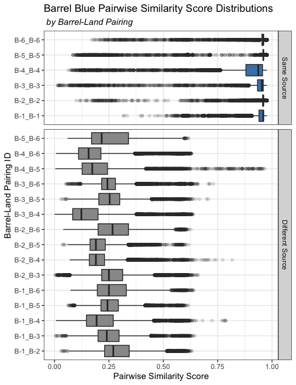
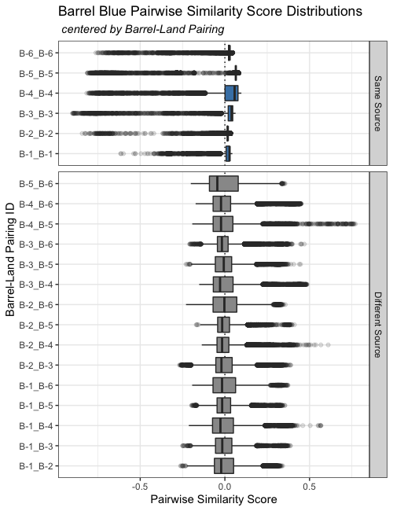

# Outline  

<br />

- Defining Reproducibility in Data Analysis  
- Analysis of Forensic Firearms Evidence  
  - Background and Vocabulary  
  - Automated Data Analysis Process  
- Measuring Repeatability and Reproducibility  
- Study Design and Data Collection  
- Modeling Approach  
  - Signature-level  
  - Pairwise-level  
- Results  
- Conclusions  
  - Discussion  
  - Future Work  


---

class: inverse, middle, center

# Defining Reproducibility in Data Analysis  


---

# Data Analysis as a Process   

Any data analysis can be conceptualized as a **pipeline**<sup>1</sup>.  

A data pipeline is sequence of *linear, sequential actions* applied to *raw data* to achieve a result.  


.footnote[[1] `r Cite(myBib, "buja")`] 

--

  
    
.center[.img[
```{r, echo = F, warning = F, message = F, out.width = '800px'}

```
]]


---

# Data Analysis as a Process   

Any data analysis can be conceptualized as a **pipeline**<sup>1</sup>.  

A data pipeline is sequence of *linear, sequential actions* applied to *raw data* to achieve a result.  
  

.footnote[[1] `r Cite(myBib, "buja")`] 

.center[.img[
```{r, echo = F, warning = F, message = F, out.width = '800px'}
knitr::include_graphics("images/pipeline/pipeline_v1_update.png")
```
]]  


---

# Variation in Data Analysis   


Working with data involves uncertainty in several ways: 

--

(1) varying input (*variation in data measurement*)  
(2)  
(3)  

<br />


```{r, echo = F, warning = F, message = F, out.width = '800px'}
knitr::include_graphics("images/pipeline/pipeline_inputs_update.png")
```


---

# Variation in Data Analysis   

Working with data involves uncertainty in several ways: 

(1) varying input (*variation in data measurement*)  
(2) varying methods (*decisions by the statistician*)  
(3)

<br />


```{r, echo = F, warning = F, message = F, out.width = '800px'}

```


---

# Variation in Data Analysis   

  
Working with data involves uncertainty in several ways: 

(1) varying input (*variation in data measurement*)  
(2) varying methods (*decisions by the statistician*)  
(3) varying code (*differences in underlying software packages*)  

<br />

```{r, echo = F, warning = F, message = F, out.width = '800px'}
knitr::include_graphics("images/pipeline/pipeline_coding_update.png")
```


---

# Process Reproducibility  


To study whether a data analysis is **reproducible**, we can measure the variability of **quantitative process output** with varying inputs and varying methods employed.     

<br /> 
--
.center[
We apply this approach to a large-scale data analysis process:  

**automatic bullet matching in forensic firearms analysis**  

]

<br />


.medium[Note: The work completed in the dissertation includes a study of three types of process variation: varying data, varying methods, and varying code. Here, we focus on varying data input.]

---

class: inverse, middle, center

# Forensic Firearms Analysis  

---

# Bullets as Forensic Evidence   


When a gun is fired, microimperfections inside the barrel engrave patterns on the surface of a bullet.  

Sections of the bullet that make contact with **lands** inside the barrel are called **land engraved areas (LEAs)**, and have **land impressions** engraved on their surface.  

Traditionally rifled gun barrels have 6 lands, which leave bullets with 6 LEAs. 

.center[
```{r rifling-and-bullets, echo = F, warning = F, message = F,out.width=c('400px', '300px')}

knitr::include_graphics("images/bullet-sketch-whitespace.png")
```
]

Forensic examiners can compare resulting **striation patterns** on LEAs from different bullets to make a determination as to whether two bullets were fired through the same gun barrel.  


---

# Bullets as Forensic Evidence   

A LEA up close:  
.center[
```{r, echo = F, warning = F, message = F, out.width = '900px'}

```
]


---

# Criticisms of Forensic Firearms Analysis   

Comparing striation patterns to determine whether two bullets originate from the *same source* or *different sources* is based on two assumptions: 

1. **consistency**: a gun will leave nearly identical marks on each bullet over time
2. **uniqueness**: no two guns will produce the same striation patters  


Recently, two major reports have found a lack of peer-reviewed scientific research to support these assumptions<sup>2</sup> <sup>3</sup>.  

.footnote[
[2] `r Cite(myBib, "NRC2009")`  
[3] (President's Council of Advisors on Science and Technology, 2016)  
]  

Both reports criticized a lack of large-scale studies to identify error rates for examinations.  

*Proposed solution*: development of automated image-analysis algorithms for comparison of striation patterns on bullet LEAs.  


---

# Automated Bullet Land Comparison   


Hare et al. of the Center for Statistics and Applications in Forensic Evidence (CSAFE) developed an automated bullet-matching process which completes pairwise comparisons of bullet LEAs<sup>4</sup>.  

.footnote[
[4] `r Cite(myBib, "Hare1")`
]

.left-code[
<br />
The Hare et al. method processes 3D scans by: 
  1. taking a horizontal crosscut  
  2. removing extraneous GEA data  
  3. removing bullet curvature  
  4. smoothing  

The result is a 2D **LEA signature** that represents the striation pattern present on a bullet's surface.  
]

.right-plot[
```{r, echo= F, warning = F, message = F, out.width = '550px'}
knitr::include_graphics("images/process_vertical_png.png")

```
]

---

# Bullet Analysis as a Process  

We can conceptualize the Hare et al. process as a pipeline:  

```{r, echo = F, warning = F, message = F, out.width = '800px'}
knitr::include_graphics("images/pipeline/pipeline_bullet_update.png")
```

<br />

--
The process relies on the translation of a physical bullet into a 3D scan, and the processing steps applied.  

We therefore study the sensitivity of the process to the data collection process:  
<br />

--


```{r, echo = F, warning = F, message = F, out.width = '800px'}

```


---

class: inverse, middle, center

# Measuring Repeatability and Reproducibility   


---

# Gauge Repeatability and Reproducibility  

**Gauge Repeatability and Reproducibility** studies are used in engineering to test a measurement system.  

Gauge R&R studies focus on taking *repeated measurements* to estimate:  

1. **repeatability** of measurements under the same environmental conditions  
  - measurements of the same object by the same operator  
2. **reproducibility** of measurements under different environmental conditions
  - measurements of the same object by different operators  


---

# Gauge Repeatability and Reproducibility  

Let $y_{ijk}$ be the measured value of part $i$, taken by operator $j$, at repetition $k$.  

The model is:  

$$y_{ijk} = \mu + \alpha_{i} + \beta_{j} + \alpha\beta_{ij} + \epsilon_{ijk}$$

where  


$$\begin{array}{rl}
\mu & \quad \mbox{is the fixed, unknown process measurement average}, \\ 
\alpha_i & \quad \mbox{is a random effect for Part}\ i,\ \mbox{following a}\ N(0, \sigma^2_{\alpha}), \\
\beta_j &\quad \mbox{is a random effect for Operator}\ j,\ \mbox{following a}\ N(0, \sigma^2_{\beta})\\
\alpha\beta_{ij} & \quad \mbox{is a random effect for Part}\ i-\mbox{Operator}\ j,\ \mbox{following a}\ N(0, \sigma^2_{\alpha\beta})  \\
\epsilon_{ijk} & \quad \mbox{is measurement error across repetitions},\ \mbox{following a}\ N(0, \sigma^2).
\end{array}$$

We assume:  

- all $\alpha_i,\ \beta_j,\ \alpha\beta_{ij},\ \epsilon_{ijk}$ are independent random variables  
- $\sigma^2_{\alpha},\ \sigma^2_{\beta},\ \sigma^2_{\alpha\beta},\ \sigma^2$ are variance components   

.medium[Note: the "operator" effect often can represent devices/machines, or simply any differing environmental conditions.]

---

class: inverse, middle, center

# Study Design and Data Collection     


---

# Three-Factor Study Design       

**Parts**: bullets  

- Multiple bullets fired through the same gun barrel  
- Striation marks on bullet LEAs are pattern we want to be reproduced  
- Striation patterns for matching LEAs expected to be *similar*, but not *identical*  

--

**Operators**: microscope operators  

- Microscope operators must stage each bullet LEA  
- Go through training, but data collection still has significant human involvement  

--

**Devices**: microscopes  

- High-resolution scanning process depends on measurement tool  
- Are there systemic differences in how LEAs are measured by different machines?  

--

**Repetition**  

- Repeated scans under the same environmental conditions (same bullet, operator, and microscope)  

---

# Scope of Study  

We were physically limited in number of operators and machines. 

- **machines**: 2 Sensofar Confocal Light Microscopes  
- **operators**: 8 trained undergraduate microscope operators  
- **bullets**: 9 bullets 
  - bullets originate from three distinct barrels, which we coded
  - interested in within-barrel comparisons
  - we will have three sets of results, one for each barrel  
  
.medium[
$$\begin{array}{rccc}
\hline
\mbox{Coded Name}             & \mbox{Test Set Name}   & \mbox{Barrel Type}     & \mbox{Ammunition Details} \\ \hline
\textbf{Barrel Orange} & \mbox{Hamby set 224}    & \mbox{Ruger P-85}     & \mbox{Winchester 9mm copper} \\ 
\textbf{Barrel Pink}   & \mbox{Houston set 3}   & \mbox{Ruger LCP}       & \mbox{American Eagle 124-grain 9mm copper} \\
\textbf{Barrel Blue}   & \mbox{LAPD}            & \mbox{Beretta 92 F/FS} & \mbox{Winchester 115-grain 9mm copper}  \\ \hline
\end{array}$$
]

- **repetitions**: 3-5 repetitions for each set of environmental conditions  
  - operators instructed to complete at least 3 repetitions 
  - repetition over time, divided into rounds
  - one round: one scan of each bullet LEA on each machine  
  

.medium[Note: each bullet has 6 individual LEAs. One round of scans for one bullet on one machine produces 6 LEA scans.]

---

# Collected Data Description  

We collected the following number of repetitions for each study factor combination:  

.medium[
$$\begin{array}{cccccccccc}
\mbox{Bullet} & \mbox{Machine} & \textbf{Op. A} & \textbf{Op. B} & \textbf{Op. C} & \textbf{Op. D} & \textbf{Op. E} & \textbf{Op. F} & \textbf{Op. G} &\textbf{Op. H}  \\ \hline
\textbf{Orange 1} & Sneox1 & 3  & 5 & 5 & 5 & 5 & 5 & 5 & 5 \\ 
&                               Sneox2 & 3  & 5 & 5 & 5 & 5 & 5 & 5 & 5 \\ \hline
\textbf{Orange 2} & Sneox1 & 3  & 5 & 5 & 5 & 5 & 5 & 5 & 5 \\
&                               Sneox2 & 3  & 5 & 5 & 5 & 5 & 5 & 5 & 5 \\ \hline
\textbf{Orange 3} & Sneox1 & 3  & 5 & 5 & 5 & 5 & 5 & 5 & 5 \\
&                               Sneox2 & 3  & 5 & 5 & 5 & 5 & 5 & 5 & 5 \\ \hline
\textbf{Pink 1} & Sneox1 & 3  & 5 & 5 & 5 & 5 & 5 & 5 & 5 \\
&                               Sneox2 & 3  & 5 & 5 & 5 & 5 & 5 & 5 & 5 \\ \hline
\textbf{Pink 2} & Sneox1 & 3  & 5 & 5 & 5 & 5 & 5 & 5 & 5 \\
&                               Sneox2 & 3  & 5 & 5 & 5 & 5 & 5 & 5 & 5 \\ \hline
\textbf{Pink 3} & Sneox1 & 3  & 5 & 5 & 5 & 5 & 5 & 5 & 5 \\
&                               Sneox2 & 3  & 5 & 5 & 5 & 5 & 5 & 5 & 5 \\ \hline
\textbf{Blue 1} & Sneox1 &    & 5  &   &   & 5  & 5 & 5 & 5 \\
&                               Sneox2 &    & 5  &   &   & 5  & 5 & 5 & 5 \\ \hline
\textbf{Blue 2} & Sneox1 &    & 5  &   &   & 5  & 5 & 5 & 5 \\
&                               Sneox2 &    & 5  &   &   & 5  & 5 & 5 & 5 \\ \hline
\textbf{Blue 3} & Sneox1 &    & 5  &   &   & 5  & 5 & 5 & 5 \\
&                               Sneox2 &    & 5  &   &   & 5  & 5 & 5 & 5 \\ \hline
\end{array}$$
]
---

# Data Exposition    

.center[
```{r, echo = F, warning = F, message = F, out.width = '500px'}
knitr::include_graphics("images/variability/signatures-blue-land6.png")
knitr::include_graphics("images/variability/signatures-orange-land2.png")

```
]

---

# Data Exposition    

```{r, echo = F, warning = F, message = F, out.width = '900px'}
knitr::include_graphics("images/variability/signatures-blue-land6.png")
```

--

```{r, echo = F, warning = F, message = F, out.width = '250px'}


```


---

class: inverse, middle, center

# Statistical Modeling Approach   


---

# Two stages of modeling  

.center[**2D LEA signatures**  


```{r, echo = F, warning = F, message = F, out.width = '600px'}
knitr::include_graphics("images/variability/signatures-blue-land6.png")
```
]

--

.center[
**Pairwise similarity scores**  

```{r, echo = F, warning = F, message = F, out.width = '600px'}
knitr::include_graphics("images/variability/two-sigs-aligned.png")
```
]


---

# Signature-level model      

A traditional three-factor Gauge R&R random effects model for our study design as follows.  

Let $z_{jkmn}$ be the measured response for bullet $j$, operator $k$, machine $m$, and repetition $n$. 

$$\begin{array}{rl}
z_{jkmn} & = \mu + \beta_j + \omega_k + \gamma_m + \beta\omega_{jk} + \beta\gamma_{jm} + \omega\gamma_{km} +
\beta\gamma\omega_{jkm} + \epsilon_{jkmn},
\end{array}$$

where

.medium[
$$\begin{array}{rl}
\mu & \quad \mbox{is a fixed, unknown process mean}, \\
\beta_{j} & \quad \mbox{is a random effect for Bullet}\ j,\ \mbox{following a}\ N(0, \sigma^2_{\beta})\\
\omega_{k} &\quad \mbox{is a random effect for Operator}\ k,\ \mbox{following a}\ N(0, \sigma^2_{\omega}) \\
\gamma_{m} & \quad \mbox{is a random effect for Machine}\ m\,\ \mbox{following a}\ N(0, \sigma^2_{\gamma}) \\
\beta\omega_{jk} & \quad \mbox{is a random effect for Bullet}\ j-\mbox{Operator}\ k,\ \mbox{following a}\ N(0, \sigma^2_{\beta\omega})  \\
\beta\gamma_{jm} & \quad \mbox{is a random effect for Bullet}\ j-\mbox{Machine}\ m,\ \mbox{following a}\ N(0, \sigma^2_{\beta\gamma})  \\
\omega\gamma_{km} & \quad \mbox{is a random effect for Operator}\ k-\mbox{Machine}\ m,\ \mbox{following a}\ N(0, \sigma^2_{\omega\gamma})  \\
\beta\omega\gamma_{jkm} & \quad \mbox{is a random effect for Bullet}\ j-\mbox{Operator}\ k-\mbox{Machine}\ m,\ \mbox{following a}\ N(0, \sigma^2_{\beta\omega\gamma})  \\
\epsilon_{jkmn} & \quad \mbox{is error across repetitions},\ \mbox{following a}\ N(0, \sigma^2) \\
\end{array}$$
]

--

We will discuss several adaptations to this model for modeling variability at the bullet signature level:  

1. mean structure  
2. including location  
3. removing dependence by subsampling  

---

# Signature-level model      

**1. mean structure**  

.center[
```{r, echo = F, warning = F, message = F, out.width = '700px'}
knitr::include_graphics("images/variability/signatures-blue-land6.png")
knitr::include_graphics("images/variability/signatures-centered-blue-land6.png")
```
]
---

# Signature-level model      

**2. including location**  

.center[
```{r, echo = F, warning = F, message = F, out.width = '700px'}

```
]

---

# Signature-level model      

**3. removing data dependence**   

.medium[Due to the inherent structure of the data, measured height values] $z_i$ .medium[at] $x_i$ .medium[locations near one another are dependent on one another:]  

.center[
```{r, echo = F, warning = F, message = F, out.width = '600px'}
knitr::include_graphics("images/variability/signatures-blue-land6.png")
knitr::include_graphics("images/variability/signatures-centered-blue-land6.png")
```
]

---

# Signature-level model      

**3. removing data dependence**   

.medium[We can plot autocorrelation functions (ACF) for signatures to investigate the extent of dependence:]  

.center[
```{r, echo = F, warning = F, message = F, out.width = '400px'}
knitr::include_graphics("images/variability/basic-acf-plot.png")

```
]


---

# Signature-level model      

**3. removing data dependence**   

.medium[We can plot autocorrelation functions (ACF) for signatures to investigate the extent of dependence:]  

.center[
```{r, echo = F, warning = F, message = F, out.width = '600px'}
knitr::include_graphics("images/variability/acf-three-examples.png")
```
]


---

# Signature-level model      

.medium[To address this, we propose modeling variability using a subsampled set of data, sampling data at every] $100^{th}$ $x_i$ .medium[location,] $x_\tilde{i}$:  

--

.center[
```{r, echo = F, warning = F, message = F, out.width = '550px'}

```
]


---

# Signature-level model      

.medium[Subsampling results in a major data reduction; we can account for this loss and uncertainty by fitting multiple *phased* models: ]

--

.center[
```{r, echo = F, warning = F, message = F, out.width = '525px'}

```
]

---

# Signature-level model      

The final signature-level model is then as follows. 

Let $z_{BLijkmn}$ be the measured height value for Barrel-Land BL, subsampled location $\tilde{i}$, bullet $j$, operator $k,$ machine $m,$ and scan repetition $n$. 

$$\begin{array}{rl}
z_{BL\tilde{i}jkmn} & = \mu + \alpha_{BL\tilde{i}} + \alpha\beta_{BL\tilde{i}j} + \alpha\omega_{BL\tilde{i}k} + \alpha\gamma_{BL\tilde{i}m} + \\
& \quad \quad \alpha\beta\omega_{BL\tilde{i}jk} + \alpha\beta\gamma_{BL\tilde{i}jm} + \alpha\omega\gamma_{BL\tilde{i}km} + \alpha\beta\gamma\omega_{BL\tilde{i}jkm} + \epsilon_{BL\tilde{i}jkmn}
\end{array}$$

where 

.medium[
$$\begin{array}{rl}
\mu & \quad \mbox{is a fixed, unknown process measurement mean}, \\
\alpha_{BL\tilde{i}} & \quad \mbox{is a fixed measurement average for Barrel-Land}\ BL\ \mbox{at subsampled}\ x\ \mbox{location}\ \tilde{i}, \\
\alpha\beta_{BL\tilde{i}j} & \quad \mbox{is a random effect for Bullet}\ j\ \mbox{by location}\ BL\tilde{i},\ \mbox{following a}\ N(0, \sigma^2_{\beta})\\
\alpha\omega_{BL\tilde{i}k} &\quad \mbox{is a random effect for Operator}\ k\ \mbox{by location}\ BL\tilde{i},\ \mbox{following a}\ N(0, \sigma^2_{\omega}) \\
\alpha\gamma_{BL\tilde{i}m} & \quad \mbox{is a random effect for Machine}\ m\  \mbox{by location}\ BL\tilde{i},\ \mbox{following a}\ N(0, \sigma^2_{\gamma}) \\
\alpha\beta\omega_{BL\tilde{i}jk} & \quad \mbox{is a random effect for Bullet}\ j-\mbox{Operator}\ k\ \mbox{by location}\ BL\tilde{i},\ \mbox{following a}\ N(0, \sigma^2_{\beta\omega})  \\
\alpha\beta\gamma_{BL\tilde{i}jm} & \quad \mbox{is a random effect for Bullet}\ j-\mbox{Machine}\ m\ \mbox{by location}\ BL\tilde{i},\ \mbox{following a}\ N(0, \sigma^2_{\beta\gamma}) \\ \alpha\omega\gamma_{BL\tilde{i}km} & \quad \mbox{is a random effect for Operator}\ k-\mbox{Machine} \ m\ \mbox{by location}\ BL\tilde{i},\ \mbox{following a}\ N(0, \sigma^2_{\omega\gamma})  \\
\alpha\beta\omega\gamma_{BL\tilde{i}jkm} & \quad \mbox{is a random effect for Bullet}\ j-\mbox{Operator}\ k-\mbox{Machine}\ m\ \mbox{by location}\ BL\tilde{i},\\
& \quad \quad \quad \mbox{following a}\ N(0, \sigma^2_{\beta\omega\gamma})  \\
\epsilon_{BL\tilde{i}jkmn} & \quad \mbox{is error across repetitions},\ \mbox{following a}\ N(0, \sigma^2). \\
\end{array}$$
]

.medium[We assume each random effect is an independent random variable.]

---

# Pairwise-level model      

We can again begin with the traditional three-factor Gauge R&R random effects model for our study design.  

Let $z_{jkmn}$ be the measured response for bullet $j$, operator $k$, machine $m$, and repetition $n$. 

$$\begin{array}{rl}
z_{jkmn} & = \mu + \beta_j + \omega_k + \gamma_m + \beta\omega_{jk} + \beta\gamma_{jm} + \omega\gamma_{km} +
\beta\gamma\omega_{jkm} + \epsilon_{jkmn},
\end{array}$$

where

.medium[
$$\begin{array}{rl}
\mu & \quad \mbox{is a fixed, unknown process mean}, \\
\beta_{j} & \quad \mbox{is a random effect for Bullet}\ j,\ \mbox{following a}\ N(0, \sigma^2_{\beta})\\
\omega_{k} &\quad \mbox{is a random effect for Operator}\ k,\ \mbox{following a}\ N(0, \sigma^2_{\omega}) \\
\gamma_{m} & \quad \mbox{is a random effect for Machine}\ m\,\ \mbox{following a}\ N(0, \sigma^2_{\gamma}) \\
\beta\omega_{jk} & \quad \mbox{is a random effect for Bullet}\ j-\mbox{Operator}\ k,\ \mbox{following a}\ N(0, \sigma^2_{\beta\omega})  \\
\beta\gamma_{jm} & \quad \mbox{is a random effect for Bullet}\ j-\mbox{Machine}\ m,\ \mbox{following a}\ N(0, \sigma^2_{\beta\gamma})  \\
\omega\gamma_{km} & \quad \mbox{is a random effect for Operator}\ k-\mbox{Machine}\ m,\ \mbox{following a}\ N(0, \sigma^2_{\omega\gamma})  \\
\beta\omega\gamma_{jkm} & \quad \mbox{is a random effect for Bullet}\ j-\mbox{Operator}\ k-\mbox{Machine}\ m,\ \mbox{following a}\ N(0, \sigma^2_{\beta\omega\gamma})  \\
\epsilon_{jkmn} & \quad \mbox{is error across repetitions},\ \mbox{following a}\ N(0, \sigma^2) \\
\end{array}$$
]

--

Here, we need to make an adaptation to the grouping and index structure...  


---

# Pairwise-level model      

We can't index similarity scores simply by $z_{jkmn}$: bullet $j$, operator $k$, machine $m$, and repetition $n$, because similarity scores are *pairwise*, and involve multiple levels.  
  - bullet 1 - operator 1 - machine 1 - repetition 1  
  - bullet 3 - operator 2 - machine 1 - repetition 3  

For similarity scores, we therefore index by *level pairing*.  

For example, instead of bullet $j$, we have bullet pairing $(j)'$:  
  - Bullets $j = 1, 2, 3$
  - Bullet pairing $(j)' = (1-1), (1-2), (1-3), (2-2), (2-3), (3-3)$  

We then have similarity score $z_{(j)'(k)'(m)'(n)'}$ which compares two signatures with bullet pairing $(j)'$, operator pairing $(k)'$, machine pairing $(m)'$, and repetition pair $(n)'$.  


  
---

# Pairwise-level model      


.left-code[
We also expect scores and score distributions to differ by which LEAs are being compared:  
  - Same-source comparisons should have high scores near 1
  - Different-source comparisons should have lower scores 
  - Different-source comparisons are not all different *in the same way*  
  
]

--

.right-plot[
.center[
```{r, echo = F, warning = F, message = F, out.width = '400px'}

```
]
]


---

# Pairwise-level model      


.left-code[
We also expect scores and score distributions to differ by which LEAs are being compared:  
  - Same-source comparisons should have high scores near 1
  - Different-source comparisons should have lower scores 
  - Different-source comparisons are not all different *in the same way*  
  
To account for this, we use the barrel-land pairing as a mean structure and fit three separate models:   

1. Same-source pairs only   
2. Different-source pairs only  
3. All pairs, pooled  
  
]


.right-plot[
.center[
```{r, echo = F, warning = F, message = F, out.width = '400px'}

```
]
]

---

# Pairwise-level model  

$$\begin{array}{rl}
z_{(BL)'(j)'(k)'(m)'(n)'} & = \mu + \alpha_{(BL)'} + \alpha\beta_{(BL)'(j)'} + \alpha\omega_{(BL)'(k)'} + \alpha\gamma_{(BL)'(m)'} + \alpha\beta\omega_{(BL)'(j)'(k)'} \\
&   \quad \quad +\ \alpha\beta\gamma_{(BL)'(j)'(m)'} + \alpha\omega\gamma_{(BL)'(k)'(m)'}+ \alpha\beta\omega\gamma_{(BL)'(j)'(k)'(m)'} + \epsilon,
\end{array}$$

where 

.medium[
$$\begin{array}{rl}
\mu & \quad \mbox{is a fixed, unknown similarity score mean}, \\
\alpha_{(BL)'} & \quad \mbox{is a fixed measurement average for Barrel-Land pairing}\ (BL)', \\
\alpha\beta_{(BL)'(j)'} & \quad \mbox{is a random effect for Bullet pairing}\ (j)'\ \mbox{by Barrel-Land pairing}\ (BL)',\\
& \quad \quad \quad \mbox{following a}\ N(0, \sigma^2_{(\beta)'})\\
\alpha\omega_{(BL)'(k)'} &\quad \mbox{is a random effect for Operator pairing}\ (k)'\ \mbox{by Barrel-Land pairing}\ (BL)',\\
& \quad \quad \quad \mbox{following a}\ N(0, \sigma^2_{(\omega)'}) \\
\alpha\gamma_{(BL)'(m)'} & \quad \mbox{is a random effect for Machine pairing}\ (m)'\ \mbox{by Barrel-Land pairing}\ (BL)',\\
& \quad \quad \quad\mbox{following a}\ N(0, \sigma^2_{(\gamma)'}) \\
\alpha\beta\omega_{(BL)'(j)'(k)'} & \quad \mbox{is a random effect for Bullet pairing}\ (j)'-\mbox{Operator pairing}\ (k)'\\
& \quad \quad \quad \mbox{by Barrel-Land pairing}\ (BL)', \mbox{following a}\ N(0, \sigma^2_{(\beta\omega)'})  \\
\alpha\beta\gamma_{(BL)'(j)'(m)'} & \quad \mbox{is a random effect for Bullet pairing}\ (j)'-\mbox{Machine pairing}\ (m)'\\
& \quad \quad \mbox{by Barrel-Land pairing}\ (BL)'\, \mbox{following a}\ N(0, \sigma^2_{(\beta\gamma)'}) \\
\alpha\omega\gamma_{(BL)'(k)'(m)'} & \quad \mbox{is a random effect for Operator pairing}\ (k)'-\mbox{Machine pairing}\ (m)'\\
& \quad \quad \quad \mbox{by Barrel-Land pairing}\ (BL)', \mbox{following a}\ N(0, \sigma^2_{(\omega\gamma)'})  \\
\alpha\beta\omega\gamma_{(BL)'(j)'(k)'(m)'} & \quad \mbox{is a random effect for Bullet pairing}\ (j)'-\mbox{Operator pairing}\ (k)'-\\
& \quad \quad \quad \mbox{-Machine pairing}\ (m)'\ \mbox{by Barrel-Land pairing}\ (BL)',\ \\
& \quad \quad \quad \mbox{following a}\ N(0, \sigma^2_{(\beta\omega\gamma)'})  \\
\epsilon_{(BL)'(j)'(k)'(m)'(n)'} & \quad \mbox{is error across repetitions},\ \mbox{following a}\ N(0, \sigma^2).
\end{array}$$
]

---

class: inverse, middle, center

# Results     

---

# Signature-level results: Barrel Orange  

.medium[We fit ten phased models and report the distribution of estimated variance components across the ten phases.]   

.center[
```{r, echo = F, warning = F, message = F, out.width = '700px'}
knitr::include_graphics("images/variability/orange-sig-model-results.png")

```
]

.medium[We note that there are certain barrel-lands that have unusually high bullet effects. We can remove any lands that have tank rash and investigate how that changes our estimates.]

---

# Signature-level results: Barrel Orange  

Tank rash occurs when a bullet strikes the sides or bottom of a water recovery tank; striation patterns are disrupted.  

.center[
```{r, echo = F, warning = F, message = F, out.width = '700px'}


```
]

---

# Signature-level results: Barrel Orange  

.medium[We fit ten phased models and report the distribution of estimated variance components across the ten phases.]    

.center[
```{r, echo = F, warning = F, message = F, out.width = '750px'}


```
]

---

# Signature-level results: Barrel Pink  

.medium[We fit ten phased models and report the distribution of estimated variance components across the ten phases.]   

.center[
```{r, echo = F, warning = F, message = F, out.width = '700px'}
knitr::include_graphics("images/variability/pink-sig-model-results.png")

```
]

.medium[We note that there are again certain barrel-lands that have unusually high bullet effects due to tank rash. ]

---

# Signature-level results: Barrel Pink  

.medium[We fit ten phased models and report the distribution of estimated variance components across the ten phases.]   

.center[
```{r, echo = F, warning = F, message = F, out.width = '700px'}
knitr::include_graphics("images/variability/pink-sig-model-results-tr.png")

```
]


---

# Signature-level results: Barrel Blue  

.medium[We fit ten phased models and report the distribution of estimated variance components across the ten phases.]   

.center[
```{r, echo = F, warning = F, message = F, out.width = '700px'}


```
]


---

# Signature-level results: All Barrels  

Summary tables here of sigma rep and sigma repr for the three barrels (when excluding any tank rash).  

.pull-left[
Barrel Orange 
.medium[
$$\begin{array}{ccc}
\mbox{Barrel-Land}      & \sigma_{repeatability} & \sigma_{reproducibility} \\ \hline
\textbf{O-1} & \textit{0.32} & \textit{0.29}\\ 
\textbf{O-2}     & 0.55 & 0.47 \\
\textbf{O-3}     & 0.42 & 0.58 \\ 
\textbf{O-4} & \textit{0.39} & \textit{0.22} \\
\textbf{O-5}     & 0.61 & 0.53 \\ 
\textbf{O-6} & \textit{0.37} & \textit{0.34}\\ \hline 
\textbf{Pooled} & \textit{0.48} & \textit{0.48}\\ \hline
\end{array}$$
]

Barrel Pink
.medium[
$$\begin{array}{ccc}
\mbox{Barrel-Land}      & \sigma_{repeatability} & \sigma_{reproducibility} \\ \hline
\textbf{P-1}     & 1.25 & 0.86 \\ 
\textbf{P-2}     & 1.83 & 1.35 \\
\textbf{P-3}     & 0.93 & 0.84 \\ 
\textbf{P-4}     & 0.77 & 0.59 \\
\textbf{P-5}     & 0.89 & 0.56 \\
\textbf{P-6} & \textit{0.99} & \textit{0.71} \\ \hline
\textbf{Pooled} & \textit{1.16} & \textit{0.88} \\ \hline
\end{array}$$
]
]

.pull-right[
Barrel Blue
.medium[
$$\begin{array}{ccc}
\mbox{Barrel-Land}      & \sigma_{repeatability} & \sigma_{reproducibility} \\ \hline
\textbf{B-1}     & 0.39 & 0.35 \\ 
\textbf{B-2}     & 0.37 & 0.35 \\
\textbf{B-3}     & 0.37 & 0.34 \\ 
\textbf{B-4}     & 0.54 & 0.49 \\
\textbf{B-5}     & 0.45 & 0.50 \\ 
\textbf{B-6}     & 0.56 & 0.68 \\ \hline \hline
\textbf{Pooled}  & 0.46 & 0.48 \\ \hline
\end{array}$$
]
]
---

# Pairwise-level results: All Barrels  

We present results for all three barrels and all three pairwise models. 

.center[
```{r, echo = F, warning = F, message = F, out.width = '900px'}


```
]


---

class: inverse, middle, center

# Wrapping Up  


---

# Conclusions and Future Work  


---

class: inverse, middle, center

# Questions?    

<!-- --- -->

<!-- # References -->

<!-- ```{r refs, echo=FALSE, results="asis"} -->
<!-- PrintBibliography(myBib) -->
<!-- ``` -->


