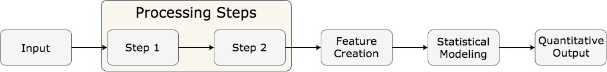
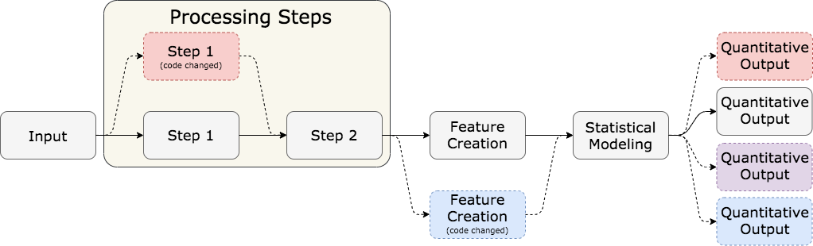
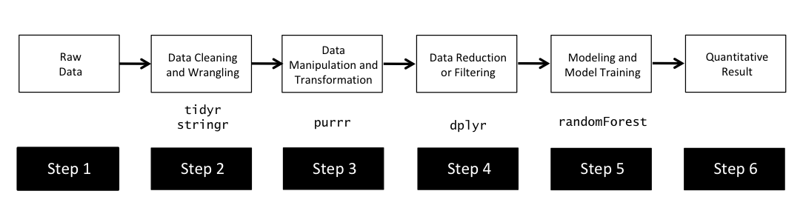
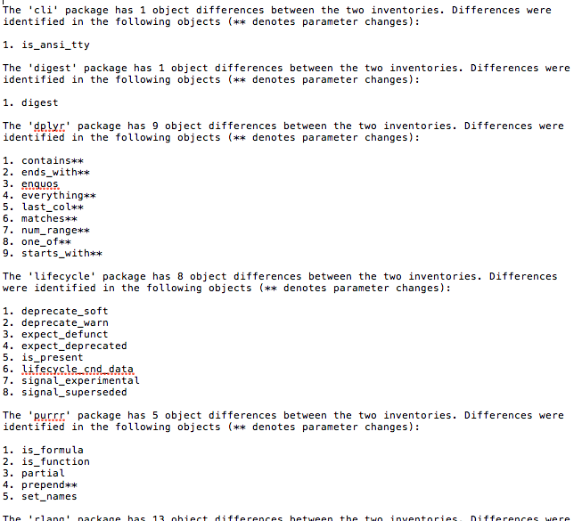
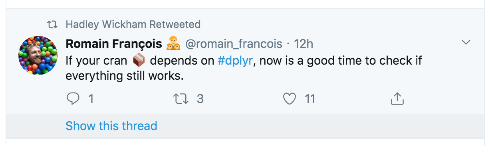
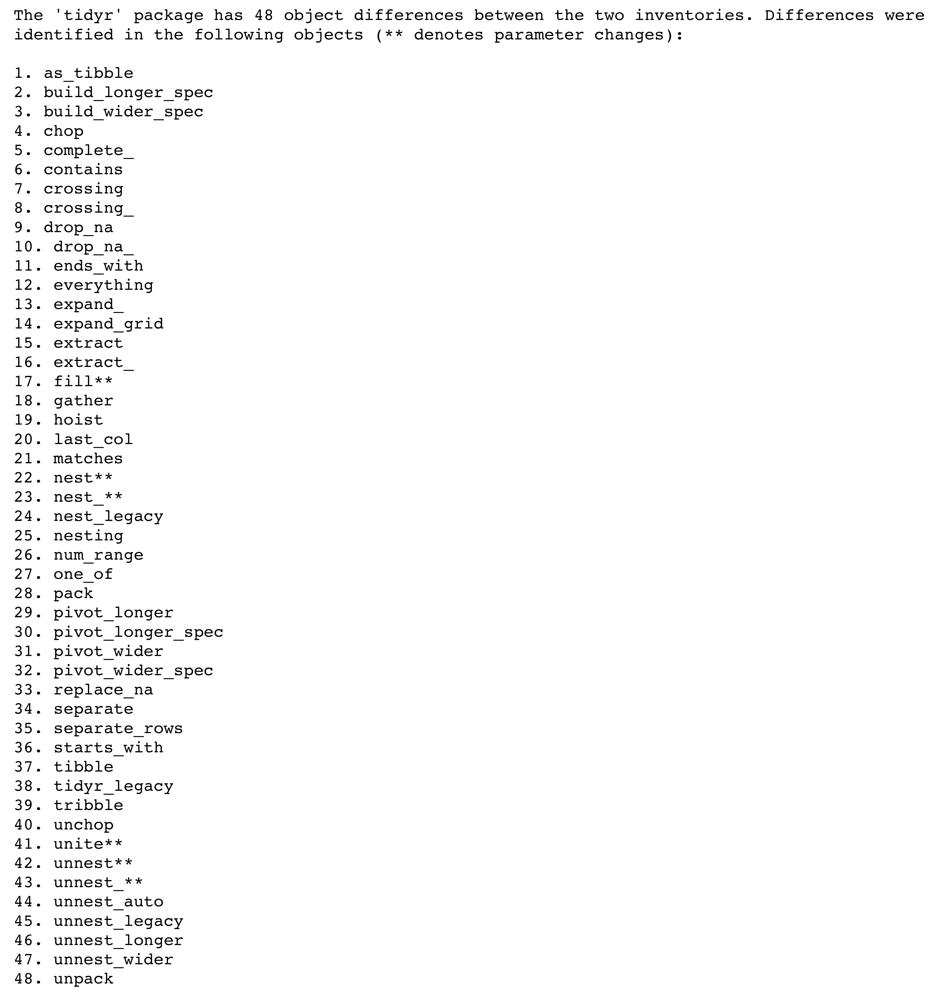
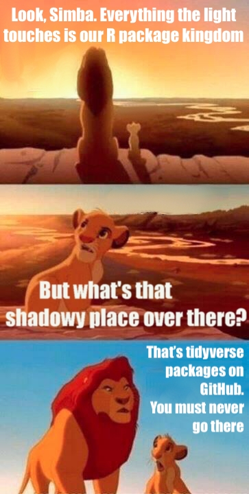

# What is Computational Reproducibility? 

## The long answer:

--

There are lots of facets!  

--

For a good overview of several approaches to computational reproducibility, see the [ROpenSci reproducibility guide](https://ropensci.github.io/reproducibility-guide/sections/introduction/). 

--

1. Literate programming and reporting  
    - Creating self-contained documents that include the code used to generate results and figures.  
    - The largest step forward in this direction in recent history (for R users) has been the creation of [`knitr`](https://yihui.org/knitr/) by Yihui Xie. 
2. Numerical reproducibility of results 
    - Code of any kind used to complete an analysis or generate results  
    - Reproduction of analysis or results across users/machines, or over time  
    
Often, (1) helps with *transparency* of methodology in research, while (2) helps with *consistency* of methodology.  

---

# Computational Reproducibility in R  

R has a language model that makes it uniquely frustrating to manage computational reproducibility.   

--

**`base` R**   
   - provides base language model  
   - data structures (logical, character, double, factor, vector, list, matrix, data.frame, etc.)  
   - framework for object manipulation (`$`, `[]`, `[[]]`, etc.)  
   - framework for function syntax (arguments, body, return object, etc.)  
   - basic functionality: (`for`, `while`, `apply`, `ifelse`, etc.)  
   - also includes some packages (e.g., `stats`, that complete data analysis)  

--

**user-developed packages**
   - many data analysis and data science capabilities are available through packages
   - `randomForest`, `lme4`, `tidyverse`, `knitr`....  
   
--

Packages are subject to change (this *includes* base packages like `stats`).  

*Note: This framework exists in Python, too, but not SAS.*  

---

# Computational Reproducibility in R  

There are a few things to note about the package framework  

**R packages can change over time**  

  - Package developers can change anything they want in their own packages
  - [CRAN (Comprehensive R Archive Network)](https://cran.r-project.org/) provides a way for users to install packages
  - CRAN packages go through a review process, but versions do still change over time  
  - GitHub versions of many popular packages also exist (usually between CRAN releases)   

**R package versioning is user/machine-specific**  

  - It is up to the user to install and upgrade packages  
  - Different users can have different sets of packages AND different versions of those packages  
  - Functionality then differs across users and machines  
  - If installing from CRAN, will install most recent release  
    
So what does this mean practically for data analysis?  


---

# Computational Reproducibility in R  

Suppose we have a data analysis pipeline like so: 

```{r, echo = F, warning = F, message = F, out.width = '\\textwidth'}

```

--

Now suppose that the underlying code changes: 

```{r, echo = F, warning = F, message = F, out.width = '\\textwidth'}

```

We now have four possible variants of our quantitative result, depending on how the code changes affect our process.  

---

class: inverse, middle, center

# Existing Reproducibility Approaches in R  


---

# Package Versioning Packages `r emo::ji("package")`

**`checkpoint` package** [(Revolution Analytics)](https://github.com/RevolutionAnalytics/checkpoint)  
  - stored versions of CRAN mirror from every day 
  - can insert a "checkpoint" in scripts for users  
  - users then use all packages from CRAN on day of checkpoint  

**`packrat` package** [(RStudio)](https://rstudio.github.io/packrat/)
  - private package library `r emo::ji("package")` `r emo::ji("book")`  
  - works on a project level, creating a library for that R project  
  - interacts with projects/scripts  
  - (*personal opinion*): bulky and makes projects a little hard to use  
  - really awesome way to create a project-specific library!  
  
**`pkgnet` package** [(Uptake)](https://uptake.github.io/pkgnet/)
  - creates "package reports" 
  - package dependency network (visual and data file)
  - function relationship/dependency network (visual and data file)  
  - this tool is very cool 
  
---

# What is missing? 

All the packages mentioned are meant for **static** package versioning.  

  - Meant to store/track packages used *at a particular point in time*.  
  - Storing and maintaining a computational environment is an important aspect of computational reproducibility!  
  - Does not allow for changes in packages across machines and over time
  - Ensures the same version (usually an old version) of a package will be used. 
  
We propose an alternate approach which takes advantage of new developments and improvements in packages... 

**Adaptive computational reproducibility!!**  


---

class: inverse, middle, center

# Our Approach  


---

# Adaptive Computational Reproducibility  

We take a two-step approach:  

1. Define and refine the scope of package dependency for a script or project.  
  - This lives somewhere in the space between `pkgnet` and `packrat`. 
  - Focuses on taking and visualizing **inventories** of packages and their dependencies  
  - Assess the level of vulnerability a script has to changes 
  

2. Compare package dependency networks over time and across users/machines  
  - Identify specific package differences between inventories  
  - Identify places in a script where differences are used  
  - Gives users a chance to identify differences *before* the code breaks  

To explain this approach, we will look at a brief example.  

---

# Step 1: Define and refine vulnerabilities  

Consider the following data analysis process that makes use of five R packages:  

```{r, out.width = '\\textwidth'}

```

--

We can take these five packages, and get a *package inventory* using the `manager` package (`r emo::ji("coder")``r emo::ji("package")``r emo::ji("coder")`): 

```{r, echo = T, eval = F}
devtools::install_github("kiegan/manager")
library(manager)
project_inventory <- take_inventory(packages = c("tidyr", "stringr", 
                                                 "purrr", "dplyr", 
                                                 "randomForest"))
```

--

We can then visualize that inventory... 


---

# Step 1: Define and refine vulnerabilities  

```{r, echo = F, eval = T}
project_inventory <- readRDS("data/kiegan_inventory.rda")
```

```{r, echo = T, eval = T, fig.width = 9, fig.height = 5, warning = F, message = F}
plot_inventory(project_inventory)
```


---

# Quick side note `r emo::ji("eyes")`  

```{r, echo = F, eval = T}
tidyverse_inventory <- readRDS("data/tidyverse_inventory.rda")
```

```{r, echo = T, eval = T, fig.width = 9, fig.height = 5, warning = F, message = F}
plot_inventory(tidyverse_inventory)
```


---

# Step 1: Define and refine vulnerabilities  

**We can see a few things:**  

1. `take_inventory` and `plot_inventory` together are a quick and easy way to get at your vulnerabilities
2. Your projects are probably more vulnerable to package changes than you realize!  
  - *anecdotally*, I know several people who have had packages disrupted by a "level 3" or "level 4" change.  
3. You maybe probably definitely shouldn't just call `library(tidyverse)` if you want to make your project reproducible. Try to define specific packages you want to use to refine the scope!   

**A few things to note:**   

1. Inventories are taken using an iterative level-by-level approach  
  - not meant to present an entire network of all connections  
    - `pkgnet` can do this for one package!  
  - if a package is already in the "tree" at a higher level, it isn't included again.  
  - meant to enumerate all vulnerabilities, not identify all connections.  
2. Inventories only focus on Depends and Imports! 
3. Inventories catalog all package objects, so that we can compare them... 


---

# Step 2: Compare inventories    

We can make use of catalogued package objects to compare package inventories to find: 

  - **nominal differences**: differences in package versions (CRAN versions, git commits, etc.)  
  - **practical differences**: differences in package objects across versions!  

We care more about **practical differences**, and we can identify them automatically using the `compare_inventory` function.  

The `compare_inventory` function uses strategically-placed **MD5 checksums** to summarize pieces of the inventory, such as:  

1. package meta-information (name, version, source, and github repo/commit)  
2. list of package dependencies 
3. package objects meta-information (object name, object checksum, parameter checksum, object type, etc.) 
4. package object checksum  
5. package object parameter checksum  

This is computationally much faster than comparing large objects, and lets us quickly filter out packages and objects which are identical across inventories and versions.  

---

# Step 2: Compare inventories    

Consider two users who take inventories using our five packages (`tidyr`, `stringr`, `purrr`, `dplyr`, `randomForest`).  

```{r, echo = F, warning = F, message = F}
kiegan_inventory <- readRDS("data/kiegan_inventory.rda")
amy_inventory <- readRDS("data/amy_inventory.rda")
```

```{r, echo = T, warning = F}
kiegan_vs_amy <- compare_inventory(inventory1 = kiegan_inventory,
                                   inventory2 = amy_inventory,
                                   summary_file = "data/kiegan_vs_amy.txt")
```

We get three results: 

1. a text summary saved to "summary_file"
2. a `$table` option which includes a row for each different object and some summary columns 
3. a `$objects` option which includes a row for each different object and all relevant info, including the deparsed objects from both inventories for easy comparison.  


---

# Step 2: Compare inventories    

Text summary:  

```{r, echo = F, warning = F, message = F, out.width = "80%"}

```

---

# Step 2: Compare inventories    

`$table` object:  

```{r, echo = T, warning = F, message = F}
head(kiegan_vs_amy$table)
```

---

# Step 2: Compare inventories    

`$objects` object:  

```{r, echo = T, warning = F, message = F}
head(kiegan_vs_amy$objects)
```


---

class: inverse, middle, center

# Case Study  

```{r, fig.width = 1, fig.height = .5, out.width=150}
knitr::include_graphics("images/tidyr-hex.png") 
```

---

# `tidyr` `r emo::ji("package")` background  

**`tidyr`** is a package by [Hadley Wickham and Lionel Henry of RStudio](https://tidyr.tidyverse.org/), and part of the `tidyverse`.  

It is meant to help users create **tidy** data:  
  - each column is a variable
  - each row is an observation  
  - each cell contains a single value  
  
`tidyr` is a widely-used package, with monthly downloads in the hundreds of thousands: 

```{r, echo = F, warning = F, message = F, fig.width = 9, fig.height = 3}
#library(dlstats)
#tidyr_cran <- cran_stats(c("tidyr", "dplyr", "ggplot2"))
#write_csv(tidyr_cran, "data/tidyr_cran_downloads.csv")
tidyr_cran <- read_csv("data/tidyr_cran_downloads.csv")
tidyr_cran %>% 
  filter(end != "2020-04-21") %>%
  ggplot() + 
  geom_line(aes(x = end, y = downloads, group = package, color = package)) + 
  geom_point(aes(x = end, y = downloads, group = package, color = package, shape = package)) + 
  theme_bw() + 
  scale_color_manual(values = c("royalblue4", "darkred", "goldenrod2")) + 
  labs(x = "Month and Year", y = "", title = "Monthly package downloads")
```

---

# `tidyr` `r emo::ji("package")` changes  

`tidyr` is also still subject to change relatively often: 
  - two package versions released in 2019, one so far in 2020<sup>1</sup> 
  - this is true for many tidyverse packages, and leaves people's code and packages vulnerable ...  
  
```{r, echo = F, warning = F, message = F}

```

Consider the following example: 
  - user with version 0.8.3 (released Mar 2, 2019)  
  - updates to version 1.0.0 (released Sep 13, 2019)  
  - all other packages on computer unchanged  

.footnote[[1] https://github.com/tidyverse/tidyr/releases]


---

# `tidyr` `r emo::ji("package")` changes  

```{r, echo = F, eval = T, warning = F, message = F}
tidyr_083 <- readRDS("data/kiegan_tidyr_only_083.rda")
tidyr_100 <- readRDS("data/kiegan_tidyr_only_100.rda")
compare_tidyr <- compare_inventory(inventory1 = tidyr_083, inventory2 = tidyr_100, summary_file = "data/tidyr_compare_summary.txt")
```

```{r, echo = T, warning = F, message = F, eval = F}
compare_tidyr <- compare_inventory(inventory1 = tidyr_083, inventory2 = tidyr_100)
```

```{r, echo = F, warning = F, message = F}

```


---

# `tidyr` `r emo::ji("package")` changes  

**Version 0.8.3** `nest()` function:  

`ChickWeight %>% nest(-Diet) %>% glimpse()`  

```{r, warning = F, message = F, eval = T, echo = F}
ChickWeight %>% nest_legacy(-Diet) %>% glimpse()
```

--

**Version 1.0.0** `nest()` function: 

`ChickWeight %>% nest(-Diet) %>% glimpse()`<sup>1</sup>

```{r, warning = F, message = F, eval = T, echo = F}
ChickWeight %>% nest(-Diet) %>% glimpse()
```

--

*Note the difference between the column names.*  

.footnote[[1] Note that in the RStudio console, the version 1.0.0 code will throw an error and not run. RMarkdown files (papers and slides) seem to render it just fine, but with incorrect column name.]

---

# `tidyr` `r emo::ji("package")` conclusions  

1. PSA: Check yo' scripts!  
2. Syntax of `nest()` has changed  
3. Second PSA: new functions have been introduced to replace `gather()` and `spread()` 
  - (`pivot_longer` and `pivot_wider`)  
4. These are the types of changes that can leave R users frustrated  
  - install a new package version
  - code is broken
  - have to spend a bunch of time hunting down the problem 
  - this happens on a regular basis!    
  
--

Now, we will look at another example... 

---

class: inverse, middle, center

# Case Study  

```{r, fig.width = 1, fig.height = .5, out.width=150}
knitr::include_graphics("images/bulletxtrctr-hex.png") 
 

```

---

# `bulletxtrctr` `r emo::ji("package")` background  

`bulletxtrctr` is one of several packages developed by a team of researchers at the Center for Statistics and Applications in Forensic Evidence (CSAFE) at Iowa State.  

It is meant to automatically complete forensic evidence comparison, using high-resolution images of bullet evidence.  

The package works in concert with three other packages: `x3ptools`, `grooveFinder`, and `bulletcp` to complete data analysis of captured `x3p` files:  

--

```{r, out.width = '\\textwidth'}
knitr::include_graphics("images/pipeline-packages.png")
```

---

# `bulletxtrctr` `r emo::ji("package")` background  

The suite of packages is both **used** and **developed** by a small-ish team of researchers. This means:  

1. The packages are under active development and subject to change  
2. Team members may have different versions of packages at any given time  
3. Analyses run by different users on different machines (or at different times), are vulnerable to changes.  

We can first look at the package dependency tree for one user (*full disclosure: it's me*)  


---

# `bulletxtrctr` `r emo::ji("package")` background  

```{r, echo = F, eval = T}
bulletxtrctr_inventory <- readRDS("data/kiegan_bulletxtrctr_inventory.rda")
```

```{r, echo = T, eval = T, fig.width = 9, fig.height = 5, warning = F, message = F}
plot_inventory(bulletxtrctr_inventory)
```


---

# `bulletxtrctr` study set-up    

But what we really want to study is the nominal and practical differences across users on the team.  

I asked researchers on the bullet team to use the `manager` package to take an inventory of the `bulletxtrctr` dependency network and send me the resulting inventories. I got:  

  - 9 different inventories 
  - 6 users (one user on 3 machines, another user on 2 machines)  
  
We can investigate first the nominal differences: 
  - what versions of each package do team members have?  

First, we look at the four bullet packages.   


---

# Bullet Package Versions  


```{r, warning = F, echo = F, message = F, fig.align = 'center', fig.width = 9, fig.height = 4}
bullet_package_versions <- read_csv("data/bullet_package_versions.csv")
bullet_package_versions %>%
  ggplot() + 
  geom_tile(aes(x = package_name, y = user_computer, 
                fill = version_info), height = 0.9, width = 0.9, 
            alpha = 0.9) + 
  theme_bw() + 
  scale_fill_manual(name = "Version Info", breaks = c("newest", "newer", "older", "oldest", "local"),
                     values = c("grey90", "grey60", "grey30", "black", "red4")) + 
  coord_flip() + 
  #theme(aspect.ratio = 4/9) + 
  labs(y = "", x = "Package Name", title = "Package version by user and machine") 

```

.medium[**Insights:**  
  - Only two machines have the same set of versions of the four packages (User K-Laptop and User S-Desktop)  
  - This is only the four bullet packages, but there are 100 packages total in the `bulletxtrctr` package dependency tree.
  - Of the 96 non-bullet packages in the tree, 73 have at least two versions across the machines involved. 
]

---

# Other Package Versions  


```{r, warning = F, echo = F, message = F, fig.align = 'center', fig.width = 9, fig.height = 8, out.width = "77%"}
nonbullet_package_meta <- read_csv("data/nonbullet_package_versions.csv")

nonbullet_package_meta %>%
  mutate(checksum_num = factor(checksum_num, levels = c("Newest", "Newer", "Middle", "Older", "Oldest"))) %>%
  ggplot() + 
  geom_tile(aes(x = user_computer, y = package_name, 
                fill = checksum_num, color = package_source), 
            width = 0.85, height = 0.85, alpha = 0.9, size = 1) +
  theme_bw() + 
  #facet_grid(rows = "package_name", scales = "free", space = "free") + 
  scale_fill_manual(name = "Package\nversion", 
                    values = c("white", "grey80", "grey60", "grey20", "black")) + 
  scale_color_manual(name = "Package\nsource",
                     values = c("black", "goldenrod2")) + 
  theme(plot.subtitle = element_text(face = "italic")) + 
  labs(x = "", y = "Object name", title = "Package version by user and machine", 
       subtitle = "for 20 of 73 packages which differ") + 
  geom_text(aes(x = user_computer, y = package_name, label = package_version),
            size = 3) + 
  geom_text(aes(x = user_computer, y = package_name, label = package_version), 
            color = "white",size = 3, 
            data = nonbullet_package_meta %>% filter((checksum_num == "Older" | checksum_num == "Oldest")))
  
```

---

# Bullet Project Package Versions  

So far we have only seen **nominal** differences, but what we have already seen shows a lot of variability! 

What is more important is the **practical** differences.  


---

# Bullet Packages: Practical Differences  

```{r, message = F, warning = F, fig.height = 8, fig.width = 9, out.width = "80%"}

bullet_object_versions <- read_csv("data/bullet_package_object_versions.csv")
bullet_object_versions %>%
  ggplot() + 
  geom_tile(aes(x = user_computer, y = object_name, 
                fill = checksum_num, color = factor(checksum_num_param)), 
            width = 0.82, height = 0.82, size = 1, alpha = 0.9) +
  theme_bw() + 
  facet_grid(rows = "package_name", scales = "free", space = "free") + 
  scale_fill_manual(name = "Function\nversion", 
                    values = c("white", "grey80", "grey60", "grey30", "black")) + 
  scale_color_manual(name = "Parameters\nversion", breaks = c("1", "2", "3"), 
                     values = c("royalblue4", "darkred", "goldenrod2")) + 
  theme(plot.subtitle = element_text(face = "italic")) + 
  labs(x = "", y = "Object name", title = "Object version by user and machine", 
       subtitle = "For package objects with differences") + 
  geom_text(aes(x = user_computer, y = object_name, label = checksum_num),
            size = 3, data = bullet_object_versions %>% filter(checksum_num != "A")) + 
  geom_text(aes(x = user_computer, y = object_name, label = checksum_num),
            size = 3, color = "white", 
            data = bullet_object_versions %>% filter((checksum_num == "D" | checksum_num == "E")))
```


---

class: inverse, middle, center

# Wrapping Up  


---

# Conclusions and Future Work  

```{r, warning = F, message = F, out.width = "33%", fig.align = 'center'}

```
    

---

# Conclusions and Future Work  

**Conclusions**  
  - your code might be more vulnerable than you think!  
  - our tools provide a way to quickly assess things and identify changes  
  - team collaboration 
  - identify changes *before* they break your code  

**Ironies That I Am Aware Of**  
  - the `manager` package relies on some `tidyverse` packages 

**Future Work**  
  - making the `manager` package less dependent on `tidyverse` packages
  - script mapping to identify a script's "flow" and where a potential code change starts affecting things  
  - visuals to better compare two dependency trees  
    - including a way to look at how it would change if you removed a package dependency  
  - C/C++ code is difficult to get around
    - when it is compiled, it gets a user-specific "address" - always different  
    
    


---

class: inverse, middle, center

# Questions?    


