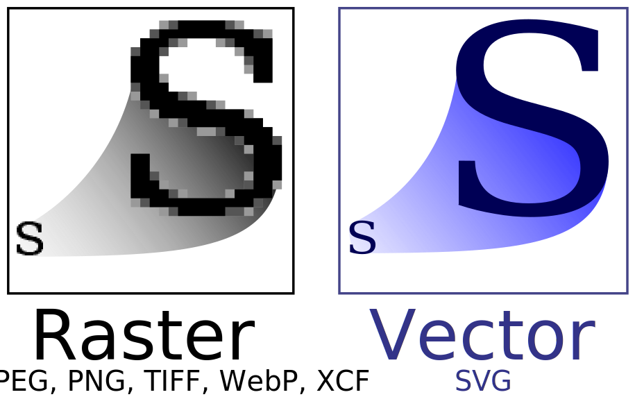
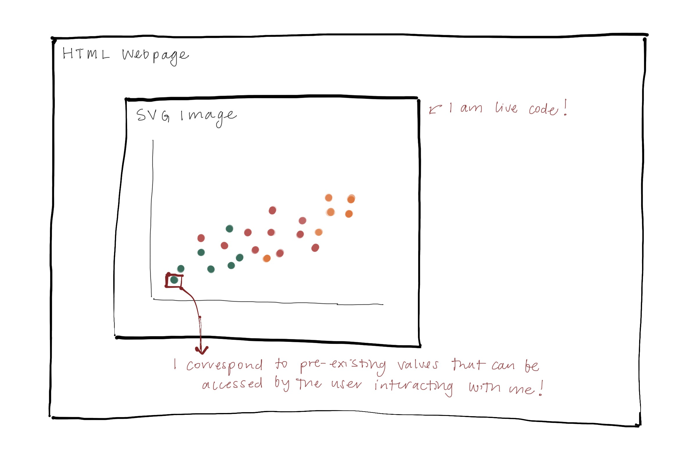
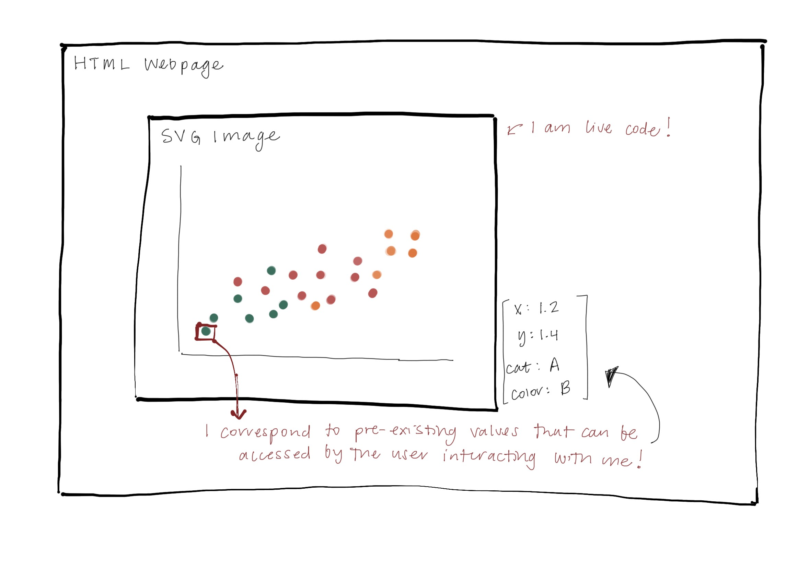
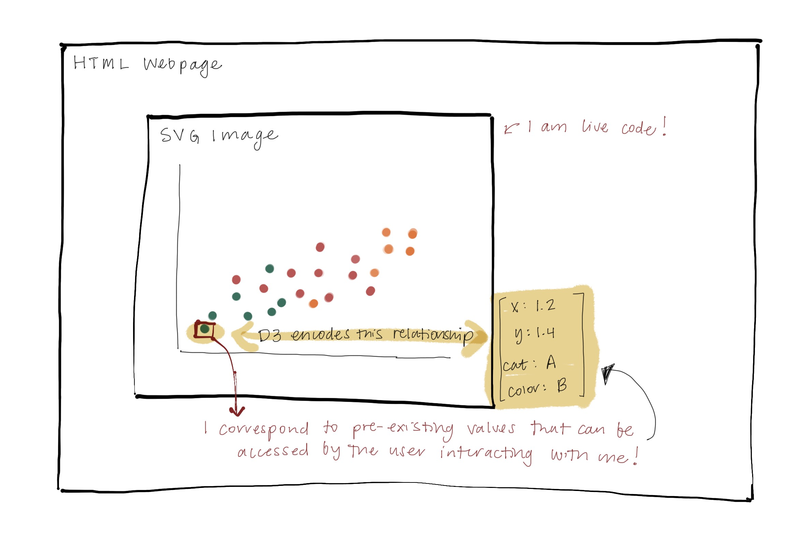

# Background of D3      

<br>  

**Who:** Created by [Mike Bostock](https://observablehq.com/@mbostock) while working on graphics at the New York Times  


<br>  

**What:** Open-source JavaScript-based graphing framework  
  - D3 = "Data-Driven Documents"  
  - In some ways, **ggplot2** *is to* **R** *as* **D3.js** *is to* **JavaScript**  
  - Functions for working with and manipulating data  
  - Framework for binding objects and layers to plotting area  
    + framework for movement and user interaction    

<br>  

**When:** D3 v1.0 released in 2011, D3.js recently celebrated it's 10th anniversary!  


---

# Resources on D3.js    

**Where** can you learn more about D3?  


1. The internet!  
  

--

   - https://www.d3-graph-gallery.com/, now superceded by https://observablehq.com/@d3/gallery   
   - Online tutorials, resources, and courses    
   - Twitter #dataviz community
   - Observable community: https://observablehq.com/ambassadors     


---

# Features of D3   

**Why** should you use D3?  

.pull-left[
.center[Animation]

```{r}
scatter2 <- penguins %>%
  r2d3(script = "js/scatter-anim.js", d3_version = "4", css = "js/scatter.css")
scatter2$sizingPolicy$padding <- "0"
save_d3_html(scatter2, "rendered/scatter2.html", selfcontained = FALSE)
```

<iframe src="rendered/scatter2.html" width="100%" height="400" scrolling="no" seamless="seamless" frameBorder="0" padding="0"> </iframe>

] 

--


.pull-right[
.center[Hover interaction]

```{r}
scatter1 <- penguins %>%
  r2d3(script = "js/scatter.js", d3_version = "4", css = "js/scatter.css")
scatter1$sizingPolicy$padding <- "0"
save_d3_html(scatter1, "rendered/scatter1.html", selfcontained = FALSE)
```

<iframe src="rendered/scatter1.html" width="100%" height="400" scrolling="no" seamless="seamless" frameBorder="0" padding="0"> </iframe>
]


.small[Horst AM, Hill AP, Gorman KB (2020). palmerpenguins: Palmer Archipelago (Antarctica) penguin data. R package version 0.1.0. https://allisonhorst.github.io/palmerpenguins/.]

---

# Features of D3   

**Why** should you use D3?  

  - Open source
    - Lots of existing examples + formats
  - Infrastructure works well for web development
  - User interaction 
    - Hovering
      - Highlighting, annotating with tooltip information or others
    - Clicking (+ driving transitions)
      - Turning certain elements on or off
    - Can integrate more (brushing, linking, etc.)
  - Highly customizable 
    - Styling, especially when paired with using CSS
    - Tons of visualization formats - the sky is the limit!   
    - Can integrate multiple plots together + transitions
      - e.g., "scrollytelling"


---

# Features of D3   

**Why** should you use D3?  

  - Open source
    - Lots of existing examples + formats
  - Infrastructure works well for web development
  - User interaction 
    - Hovering
      - Highlighting, annotating with tooltip information or others
    - Clicking (+ driving transitions)
      - Turning certain elements on or off
    - Can integrate more (brushing, linking, etc.)
  - **Highly customizable** 
    - **Styling, especially when paired with using CSS**
    - Tons of visualization formats - the sky is the limit!    
    - **Can integrate multiple plots together + transitions**
      - **e.g., "scrollytelling"**
      
...**features that plotly does not provide**  


---

# Features of D3   

**Why** should you use D3? (continued)  
<br>  

  - Many interactive data visualizations on the web are built using D3 
    - New York Times  
    - FiveThirtyEight  
    - Washington Post  
    - Pew Research Center  

<br>  

... and, it's really easy to implement using r2d3!  


---

class: inverse, middle, center

```{r, out.width='45%'}
knitr::include_graphics("images/r2d3.png")
```


---

# Relationship between D3 and R   

**Why** should you use D3 *with R using the `r2d3` package?*  

<br> 

  - you can easily integrate a D3 visual into existing formats in R... 
    - RMarkdown with HTML output  
      - slides<sup>1</sup>, HTML documents, blogdown
    - Shiny applications (I find this especially impactful)  
      - Example we worked on at NORC:  
        - https://mcbs-interactives.norc.org/preventive.html  
<br>  
  - `r2d3` makes it easy to do your data processing in R, then apply D3.js code to visualize that data!  
  
.footnote[[1] Note: in xaringan slides, I had to save out as html and read back in into an iframe.]


---

# Relationship between D3 and R   


**What** does the r2d3 package do?  

<br>  

  1. Converts data in R to JSON that can be interpreted by JavaScript   
    - Object is named 'data'
    - Columns can be accessed
--
  2. Sources D3 code library  
    - Grabs version specified in function  
--
  3. Creates plot container (svg is default)  
    - Or different container if specified  
    - specifies width and height of plot container   
--
  4. Renders plot object using JavaScript and CSS files called in r2d3 call  


---

# Relationship between D3 and R   

<br>  
Literally all you have to do is... 
<br>  
  
```{r, echo = T, eval = F}
  r2d3(
    data = penguins, 
    script = "scatter.js", # this is the D3.js code! 
    css = "scatter.css", # this is the CSS code to go with the scatter.js file
    d3_version= "4" # specify which D3 version (3 - 6 supported)
  )
```
  


---

class: inverse, center   

By now you're probably wondering...  

 

--

And the answer is...  

  


---

class: inverse, center   

By now you're probably wondering...  

 


And the answer is...  

```{r, echo = F, out.width='50%'}
knitr::include_graphics("images/SVG_logo_h.svg")
```
<!--    -->

 
.small[By W3C, CC BY-SA 4.0, https://commons.wikimedia.org/w/index.php?curid=89557878]


---

# All About SVG   

.center[**SVG**: **S**calable **V**ector **G**raphics  

```{r, echo = F, out.width='50%'}

```
<!--    -->

.small[Yug, modifications by 3247, CC BY-SA 2.5 <https://creativecommons.org/licenses/by-sa/2.5>, via Wikimedia Commons]
]


- Scaling of vector graphics preserves the *shapes* rather than the pixels.  
- XML (E**x**tensible **M**arkup **L**anguage)-based
  - Human readable + machine readable  
  - Interactivity + animation supported  
- JavaScript for scripting, CSS for styling  
  
  
  
---

# All About SVG   

```{r svg-doodle, echo = F, out.width='1000px'}

```


---

# All About SVG   

```{r svg-doodle2, echo = F, out.width='1000px'}

```


---

# All About SVG   

```{r svg-doodle3, echo = F, out.width='1000px'}

```


---

class: inverse, middle, center

# Structure of D3     


---

# Grammar of D3  

Just like ggplot2, D3 has a grammar!  
  - elements (e.g., rect, circle, text, path)  
    - attributes  
    - styles  
  - scales  
    - These are not automatically assigned by D3 like they are in ggplot2
  
New things  
  - animations  
    - transitions, enters, exits  
  - interactions  
    - mouseover/mouseleave  


---
class: inverse, middle, center

# Let's try it out!  


Follow along with examples  

https://github.com/kiegan/talks/blob/master/graphics-group-r2d3/demo-plots.Rmd   

You will need the corresponding code from the 'js' folder
    

---
# Let's try it out! 

```{r, echo = F}
scatter3 <- penguins %>%
  r2d3(script = "js/scatter-basic.js", d3_version = "4", css = "js/scatter.css")
scatter3$sizingPolicy$padding <- "0"
save_d3_html(scatter3, "rendered/scatter3.html", selfcontained = FALSE)
```

.left-code[
<!-- R code:   -->

```{r, eval = F, echo = F}
penguins %>%
  r2d3(script = "js/scatter-basic.js", 
       d3_version = "4", 
       css = "js/scatter.css")
```

`scatter-basic.js`:  

```{r, echo = T, eval = F}
svg.selectAll('circle')
  .data(data)
  .enter().append('circle')
    .attr('cx', function(d) { 
      return d.flipper_length_mm; })
    .attr('cy', function(d) {
      return d.bill_length_mm; })
    .attr('r', 5)
    .attr('fill', 'steelblue');
```
]  

.right-plot[
<iframe src="rendered/scatter3.html" width="100%" height="400" scrolling="no" seamless="seamless" frameBorder="0" padding="0"> </iframe>
]

---
# Let's try it out! 

```{r, echo = F}
scatter4 <- penguins %>%
  r2d3(script = "js/scatter-color.js", d3_version = "4", css = "js/scatter.css")
scatter4$sizingPolicy$padding <- "0"
save_d3_html(scatter4, "rendered/scatter4.html", selfcontained = FALSE)
```

.left-code[
`scatter-color.js`:  

```{r, echo = T, eval = F}
  var color = d3.scaleOrdinal() #<<
    .domain(["Adelie", "Chinstrap", #<<
             "Gentoo" ]) #<<
    .range(["darkorange", "purple", #<<
             "darkgreen"]); #<<
    
svg.selectAll('circle')
  .data(data)
  .enter().append('circle')
    .attr('cx', function(d) { 
      return d.flipper_length_mm; })
    .attr('cy', function(d) {
      return d.bill_length_mm; })
    .attr('r', 5)
    .style("fill", function (d) { #<<
      return color(d.species) } ); #<<
    
```
]  

.right-plot[
<iframe src="rendered/scatter4.html" width="100%" height="400" scrolling="no" seamless="seamless" frameBorder="0" padding="0"> </iframe>
]


---
# Let's try it out! 

```{r, echo = F}
scatter5 <- penguins %>%
  r2d3(script = "js/scatter-xscale.js", d3_version = "4", css = "js/scatter.css")
scatter5$sizingPolicy$padding <- "0"
save_d3_html(scatter5, "rendered/scatter5.html", selfcontained = FALSE)
```

.left-code[
`scatter-xscale.js`:  
```{r, echo = T, eval = F}

var x = d3.scaleLinear() #<<
    .domain([165, 240]) #<<
    .range([ 0, width]);  #<<
    
    
var color = d3.scaleOrdinal() 
    .domain(["Adelie", "Chinstrap", 
             "Gentoo" ]) 
    .range(["darkorange", "purple", 
             "darkgreen"]); 
    
svg.selectAll('circle')
  .data(data)
  .enter().append('circle')
    .attr('cx', function(d) { 
      return x(d.flipper_length_mm); }) #<<
    .attr('cy', function(d) {
      return d.bill_length_mm; })
    .attr('r', 5)
    .style("fill", function (d) { 
      return color(d.species) } ); 
    
```
]  

.right-plot[
<iframe src="rendered/scatter5.html" width="100%" height="400" scrolling="no" seamless="seamless" frameBorder="0" padding="0"> </iframe>
]

---
# Let's try it out! 

```{r, echo = F}
scatter6 <- penguins %>%
  r2d3(script = "js/scatter-yscale.js", d3_version = "4", css = "js/scatter.css")
scatter6$sizingPolicy$padding <- "0"
save_d3_html(scatter6, "rendered/scatter6.html", selfcontained = FALSE)
```

.left-code[
`scatter-yscale.js`:  
```{r, echo = T, eval = F}
var x = d3.scaleLinear() 
    .domain([165, 240]) 
    .range([ 0, width]);  
    
var y = d3.scaleLinear() #<<
    .domain([30, 60]) #<<
    .range([ height, 0]); #<<
# ... 
    
svg.selectAll('circle')
  .data(data)
  .enter().append('circle')
    .attr('cx', function(d) { 
      return x(d.flipper_length_mm); }) 
    .attr('cy', function(d) {
      return y(d.bill_length_mm); }) #<<
    .attr('r', 5)
    .style("fill", function (d) { 
      return color(d.species) } ); 
```
]  

.right-plot[
<iframe src="rendered/scatter6.html" width="100%" height="400" scrolling="no" seamless="seamless" frameBorder="0" padding="0"> </iframe>
]  


---
# Let's try it out! 

```{r, echo = F}
scatter7 <- penguins %>%
  r2d3(script = "js/scatter-hover.js", d3_version = "4", css = "js/scatter.css")
scatter7$sizingPolicy$padding <- "0"
save_d3_html(scatter7, "rendered/scatter7.html", selfcontained = FALSE)
```

.left-code[
`scatter-hover.js`:  

.smalmed[
```{r, echo = T, eval = F}

svg.selectAll('circle')
  .data(data)
  .enter().append('circle')
    .attr('cx', function(d) { 
      return x(d.flipper_length_mm); }) 
#... 
    .style("stroke-width", 0) #<<
    .style("stroke", "black") #<<
    .style("opacity", 0.8) #<<
    .on("mouseover", function(d){ #<<
        d3.select(this) #<<
          .attr("r", 10) #<<
          .style("stroke-width", 2) #<<
          .style("opacity", 1); #<<
    })#<<
    .on("mouseout", function(d){#<<
      d3.select(this)#<<
        .attr("r", 5)#<<
        .style("stroke-width", 0)#<<
        .style("opacity", 0.8);#<<
    })#<<
```
]
]


.right-plot[
<iframe src="rendered/scatter7.html" width="100%" height="400" scrolling="no" seamless="seamless" frameBorder="0" padding="0"> </iframe>
]  


---
# Let's try it out! 

```{r, echo = F}
scatter8 <- penguins %>%
  r2d3(script = "js/scatter-tooltip.js", d3_version = "4", css = "js/scatter.css")
scatter8$sizingPolicy$padding <- "0"
save_d3_html(scatter8, "rendered/scatter8.html", selfcontained = FALSE)
```

.left-code[
`scatter-tooltip.js`:  

.smalmed[
```{r, echo = T, eval = F}
var ttip = d3.select("body").append("div")	#<<
    .attr("class", "tooltip")	#<<			
    .style("opacity", 0); #<<
# ... 
    
svg.selectAll('circle')
  .data(data)
  .enter().append('circle')
    .attr('cx', function(d) { 
      return x(d.flipper_length_mm); }) 
#... 
    .style("stroke-width", 0) 
    .style("stroke", "black") 
    .style("opacity", 0.8)
    .on("mouseover", function(d){ 
        d3.select(this)
          .attr("r", 10) 
          .style("stroke-width", 2) 
          .style("opacity", 1); 
        ttip.style("opacity", 0.9); #<<
        ttip.html("This is a " + d.species + " penguin" + "<br/>" +  #<<
                  "from " + d.island + " island") #<<
            .style("left", (d3.event.pageX) + 5 + "px") #<<
            .style("top", (d3.event.pageY) + "px"); #<<
    })
    .on("mouseout", function(d){
      d3.select(this)
        .attr("r", 5)
        .style("stroke-width", 0)
        .style("opacity", 0.8);
      ttip.style("opacity", 0);#<<
    })
```
]
]


.right-plot[
<iframe src="rendered/scatter8.html" width="100%" height="400" scrolling="no" seamless="seamless" frameBorder="0" padding="0"> </iframe>
]  

---
# ...And more!!!  

What else can you do? 

  - axes  
  - margins + padding to make space for axes  
  - animation  
  - dynamic scales + image sizing  
  - tons of formats  
    - dots, bars, lines, text, beeswarms, networks, sankeys, parallel sets, etc... 
    - https://observablehq.com/@d3/gallery  

... and so much more! 

  - wizardry with CSS styling  
    - interactivity can be coded in CSS too  
    


  

---

# Conclusions     

<br>  

  - D3 is amazing
  - going from ggplot2 to D3 grammar is actually not the worst!  
    - still takes time + energy to learn  
    - a lot of googling  
  - more customizable interaction + animation than plotly  
    - steeper learning curve though  
  - you can make beautiful interactive graphics!  
  
  

---

class: inverse, middle, center

# Questions?    


---

# Appendix A  

How to go from a D3 example to something that works with R2D3???

Typically, you can do this in 3 easy steps!  

1. Remove "call data" - often a d3.csv() call
  - This is a wrapper and you can get rid of it! We already have our data! 
2. Change where you are appending elements inside the JS file (they should be appended to SVG!)  
3. Change specific variable calls to match the data you have.  


"D3 examples will generally include code to load data, create an SVG or other root element, and establish a width and height for the visualization" (https://rstudio.github.io/r2d3/index.html)
