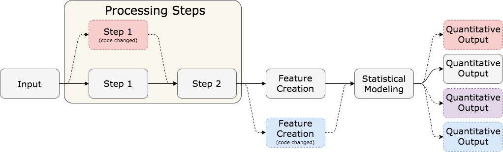

# Defining Computational Reproducibility  

**Literate programming and reporting**  
  - Self-contained documents, containing code to generate results and figures  
  - *transparency* of methodology  

--

**Numerical reproducibility of results**  
  - Code used to generate results  
  - Reproduce across users/machines, over time  
  - *consistency* of methodology  

--

```{r, echo = F, warning = F, message = F, out.width = '\\textwidth'}

```


---

# Computational Reproducibility in R  

**R Language Model**  
- base R: data structures, object manipulation, and function syntax. A few packages.   
- user-developed packages: many data analysis and data science capabilities  
  - e.g. `randomForest`, `lme4`, `tidyverse`, `knitr`  
- packages subject to change   

**R package versioning is user/machine-specific**  
  - User must install and update packages  
  - Different sets of packages, different versions of packages  
  - Functionality differences across users and machines  
  - CRAN (Comprehensive R Archive Network)  
    - Review process  
    - Versions change over time  

What does this mean for reproducing analyses in R?  

---

class: inverse, middle, center

# Existing Reproducibility Approaches in R  


---

# Package Versioning Packages  

**`checkpoint` package** [(Revolution Analytics)](https://github.com/RevolutionAnalytics/checkpoint)  
  - stored versions of CRAN mirror from every day 
  - can insert a "checkpoint" in scripts for users  
  - users then use all package versions from CRAN at checkpoint  

**`packrat` package** [(RStudio)](https://rstudio.github.io/packrat/)
  - private package library   
  - works on a project level, creating a library for that R project  

**`pkgnet` package** [(Uptake)](https://uptake.github.io/pkgnet/)
  - creates "package reports" 
  - package dependency network 
    - interactive visualization and data table  
  - function relationship/dependency network  
    - interactive visualization and data table  
  
---

# What is missing? 

Prior approaches are meant for **static** package versioning.  

  - Meant to document packages used *at a particular point in time*.  
  - Storing and maintaining a computational environment    
  - Ensures the same version of a package will be used  
  - Doesn't take advantage of changes and innovations  
  
We propose an alternate approach:  

**adaptive computational reproducibility**  


---

class: inverse, middle, center

# Adaptive Computational Reproducibility    

---

# Two-Step Approach  

**Step 1**: Define and refine the scope of package dependency for a script or project.  
  - This lives in the space between `pkgnet` and `packrat`. 
  - Focuses on taking and visualizing **inventories** of packages and their dependencies  
  - Assess the level of vulnerability a script has to changes  
  
<br />

**Step 2**: Compare package inventories over time and across users/machines  
  - Identify specific package differences between inventories  
  - Identify places in a script where differences are used  
  - Gives users a chance to identify differences *before* the code breaks  

<br />
Tools to take this approach in R: `manager` package  

---

# Step 1: Define and refine vulnerabilities  

Consider the following data analysis process that makes use of five R packages:  

```{r, out.width = '\\textwidth'}
knitr::include_graphics("images/pipeline_small_rfuncs.png")
```

--

We can take these five packages, and get a *package inventory* using the `manager` package: 

```{r, echo = T, eval = F}
devtools::install_github("kiegan/manager")
library(manager)
project_inventory <- take_inventory(packages = c("tidyr", "stringr", 
                                                 "purrr", "dplyr", 
                                                 "randomForest"))
```

--

We can then visualize that inventory... 


---

# Step 1: Define and refine vulnerabilities  

```{r, echo = F, eval = T}
project_inventory <- readRDS("data/kiegan_inventory.rda")
```

```{r, echo = T, eval = T, fig.width = 9, fig.height = 5, warning = F, message = F}
plot_inventory(project_inventory)
```


---

# Step 1: Define and refine vulnerabilities  

<br /> 
<br />

**Taking inventory**:  

1. Using an iterative level-by-level approach  
  - not meant to present an entire network of all connections  
      - `pkgnet` can do this for one package!  
  - if a package is already in the dependency tree at a higher level, it isn't included again.  
2. Inventories only focus on packages listed as Depends and Imports  
3. Inventories catalog all package objects  


---

# Quick side note   

```{r, echo = F, eval = T}
tidyverse_inventory <- readRDS("data/tidyverse_inventory.rda")
```

```{r, echo = T, eval = T, fig.width = 9, fig.height = 5, warning = F, message = F}
plot_inventory(tidyverse_inventory)
```


---

# Step 2: Compare inventories    

Use catalogued package objects to compare package inventories to find: 

  - **nominal differences**  
  - **practical differences**  

Strategically-placed **MD5 checksums** to summarize pieces of the inventory:  

- package meta-information  
- package objects 
- package object parameters  

<br />
- computationally much faster than comparing large objects
- can quickly identify packages and objects which are not identical    


---

# Step 2: Compare inventories    

Consider two users who take inventories using our five packages (`tidyr`, `stringr`, `purrr`, `dplyr`, `randomForest`).  

```{r, echo = F, warning = F, message = F}
kiegan_inventory <- readRDS("data/kiegan_inventory.rda")
amy_inventory <- readRDS("data/amy_inventory.rda")
```

```{r, echo = T, warning = F}
kiegan_vs_amy <- compare_inventory(inventory1 = kiegan_inventory,
                                   inventory2 = amy_inventory,
                                   summary_file = "data/kiegan_vs_amy.txt")
```

We get three results: 

1. a text summary saved to "summary_file"
2. a `$table` object: row for each different object and some summary columns 
3. a `$objects` object: row for each different object and additional info 
  - deparsed objects from both inventories   
  
<br />  

Requires two independent inventories to be taken and loaded at the same time.  


---

# Step 2: Compare inventories    

Text summary:  

```{r, echo = F, warning = F, message = F, out.width = "80%"}

```

---

# Step 2: Compare inventories    

`$objects` object:  

```{r, echo = T, warning = F, message = F}
head(kiegan_vs_amy$objects)
```


---

class: inverse, middle, center

# Case Study  

```{r, fig.width = 1, fig.height = .5, out.width=150}
knitr::include_graphics("images/tidyr-hex.png") 
```

---

# `tidyr` background  

**`tidyr`** is a package by [Hadley Wickham and Lionel Henry of RStudio](https://tidyr.tidyverse.org/), and part of the `tidyverse`.  

It is meant to help users create **tidy** data:  
  - each column is a variable
  - each row is an observation  
  - each cell contains a single value  
  
`tidyr` is a widely-used package, with monthly downloads in the hundreds of thousands: 

```{r, echo = F, warning = F, message = F, fig.width = 9, fig.height = 3}
#library(dlstats)
#tidyr_cran <- cran_stats(c("tidyr", "dplyr", "ggplot2"))
#write_csv(tidyr_cran, "data/tidyr_cran_downloads.csv")
tidyr_cran <- read_csv("data/tidyr_cran_downloads.csv")
tidyr_cran %>% 
  filter(end != "2020-04-21") %>%
  ggplot() + 
  geom_line(aes(x = end, y = downloads, group = package, color = package)) + 
  geom_point(aes(x = end, y = downloads, group = package, color = package, shape = package)) + 
  theme_bw() + 
  scale_color_manual(values = c("royalblue4", "darkred", "goldenrod2")) + 
  labs(x = "Month and Year", y = "", title = "Monthly package downloads")
```

---

# `tidyr` changes  

`tidyr` is also still subject to change relatively often:  
  - two package versions released in 2019, one so far in 2020<sup>1</sup>  
  - this is true for many tidyverse packages, and leaves people's code and packages vulnerable   


<br /> 

--

Consider the following example: 
  - user with version 0.8.3 (released Mar 2, 2019)  
  - updates to version 1.0.0 (released Sep 13, 2019)  
  - all other packages on computer unchanged  

.footnote[[1] https://github.com/tidyverse/tidyr/releases]


---

# `tidyr` changes  

```{r, echo = F, eval = T, warning = F, message = F}
tidyr_083 <- readRDS("data/kiegan_tidyr_only_083.rda")
tidyr_100 <- readRDS("data/kiegan_tidyr_only_100.rda")
compare_tidyr <- compare_inventory(inventory1 = tidyr_083, inventory2 = tidyr_100, summary_file = "data/tidyr_compare_summary.txt")
```

```{r, echo = T, warning = F, message = F, eval = F}
compare_tidyr <- compare_inventory(inventory1 = tidyr_083, inventory2 = tidyr_100)
```

```{r, echo = F, warning = F, message = F}

```


---

# `tidyr` changes  

**Version 0.8.3** `nest()` function:  

`ChickWeight %>% nest(-Diet) %>% glimpse()`  

```{r, warning = F, message = F, eval = T, echo = F}
ChickWeight %>% nest_legacy(-Diet) %>% glimpse()
```

--

**Version 1.0.0** `nest()` function: 

`ChickWeight %>% nest(-Diet) %>% glimpse()`<sup>1</sup>

```{r, warning = F, message = F, eval = T, echo = F}
ChickWeight %>% nest(-Diet) %>% glimpse()
```

--

*Note the difference between the column names.*  

.footnote[[1] Note that in the RStudio console, the version 1.0.0 code will throw an error and not run. RMarkdown files (papers and slides) seem to render it just fine, but with incorrect column name.]

---

# `tidyr` conclusions  

<br /> 
- Syntax of `nest()` has changed  

<br /> 

- Developers provide release notes and warning messages  

<br />  
- Can still break your code!  
  
---

class: inverse, middle, center

# Wrapping Up  


---

# Conclusions and Future Work  

**Conclusions**  
  - identify changes *before* they break your code  
    - changes to packages over time  
    - differences in package versions across machines  
  - our tools provide a way to quickly assess things and identify changes  
  - team collaboration or reproducibility over time  


--


**Future Work**  
  - making the `manager` package less dependent on `tidyverse` packages
  - C/C++ code is difficult to get around
    - when it is compiled, it gets a user-specific "address"   
  - **interactivity**: 
    - script mapping: identify how scripts use functions and the relationship between them  
    - comparing two dependency trees  
    - remove a package dependency - how much does that simplify the tree?
    
    


---

class: inverse, middle, center

# Thank You!     


